# Intégration enecess pour Home Assistant (Version de test)

[Deutsch](README.de.md) • [Français](README.fr.md) • [中文](README.zh-CN.md)

Ce dépôt fournit une intégration personnalisée pour **Home Assistant (HA)** destinée aux produits de la marque **enecess**.

## Appareils pris en charge

- **EcoMain**
    - Local (Modbus TCP, avec découverte zeroconf / mDNS)
    - Cloud (cloud enecess)

> D’autres appareils enecess pourront être ajoutés dans de futures versions.

---

## Installation (dépôt personnalisé HACS)

Cette intégration est prévue pour être installée via **HACS** en tant que **dépôt personnalisé**.

### 1) Installer HACS (si ce n’est pas déjà fait)

Suivez le guide officiel d’utilisation de HACS :

- **Commencer avec HACS**  
  [👉 Cliquer pour continuer](https://hacs.xyz/docs/use/)

### 2) Ajouter ce dépôt à HACS

#### Option A : Ajout en un clic (recommandé)

Cliquez sur le bouton ci-dessous pour ajouter ce dépôt à HACS en tant qu’intégration personnalisée :

- **Ajouter à HACS (redirection My Home Assistant) :**  
  [👉 Cliquer pour continuer](https://my.home-assistant.io/redirect/hacs_repository/?owner=enecess&repository=ha-enecess&category=integration)

> Après avoir cliqué sur le lien, renseignez l’adresse de **votre instance Home Assistant** sur la nouvelle page.

> **Capture d’écran du processus :**  
> 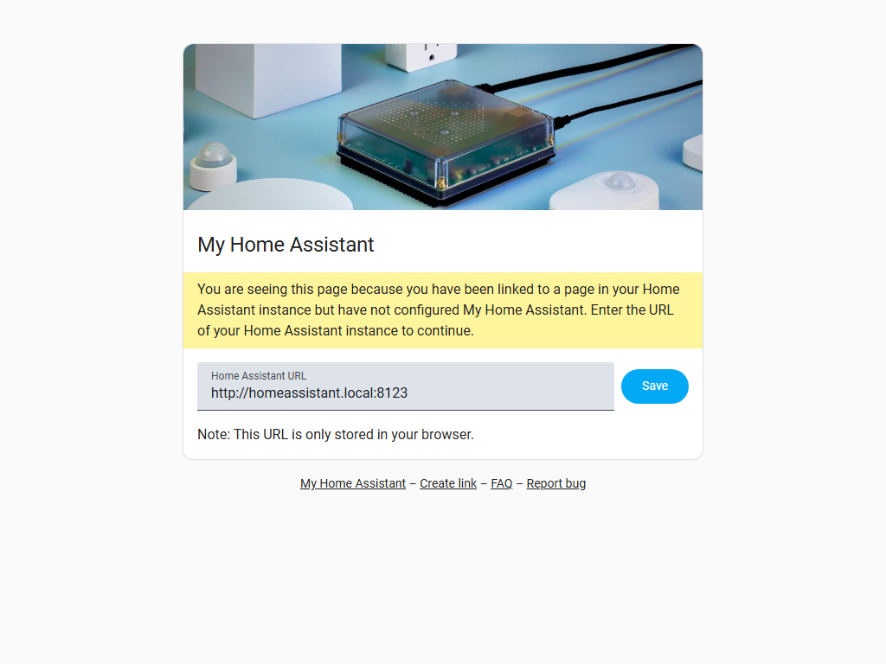

#### Option B : Ajout manuel dans HACS

1. Ouvrez Home Assistant.
2. Allez dans **HACS**.
3. Ouvrez le menu (en haut à droite) → **Custom repositories**.
4. Collez l’URL du dépôt (par ex. `https://github.com/enecess/ha-enecess`).
5. Catégorie : **Integration**
6. Cliquez sur **Add**.

> **Capture d’écran du processus :**  
> 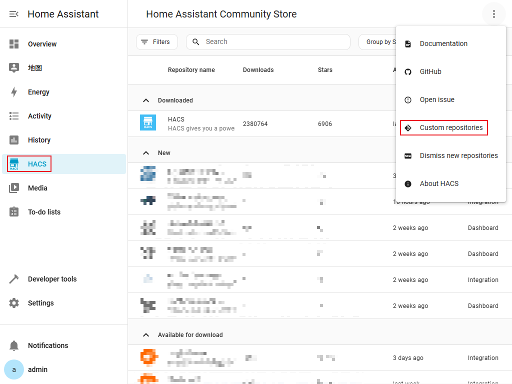
---
> 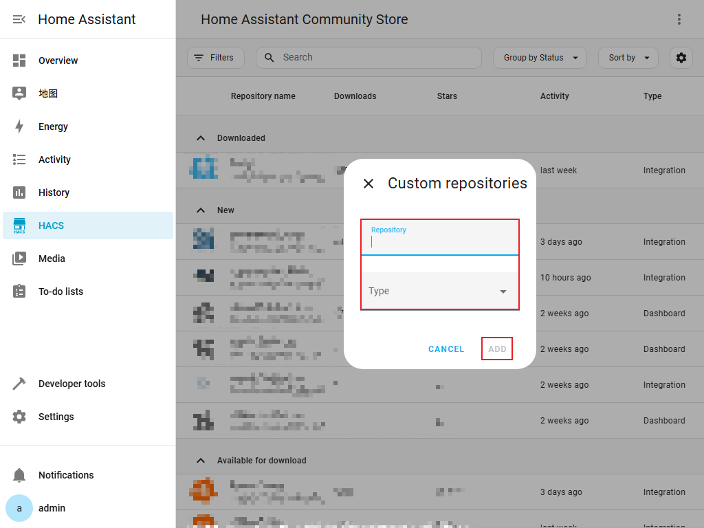

### 3) Télécharger / installer l’intégration depuis HACS

1. Dans HACS, allez dans **Integrations**.
2. Recherchez **enecess**.
3. Ouvrez la fiche → cliquez sur **Download**.
4. Une fois le téléchargement terminé, **redémarrez Home Assistant** :
    - Paramètres → Système → Redémarrer

> **Capture d’écran du processus :**  
> 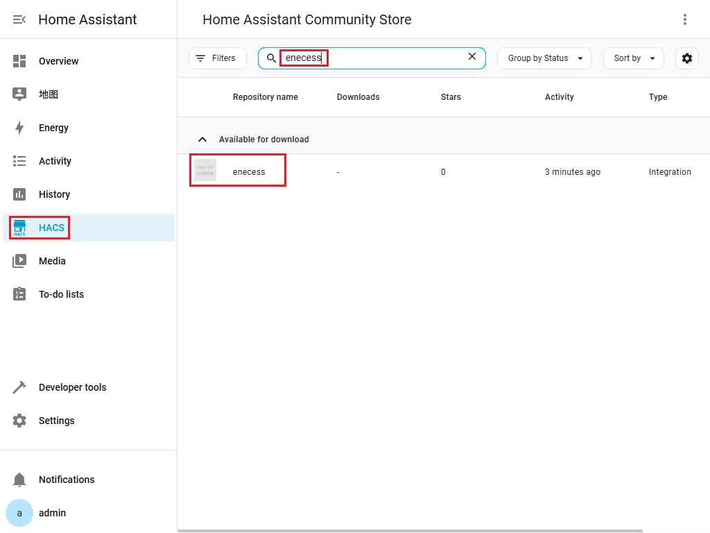
---
> 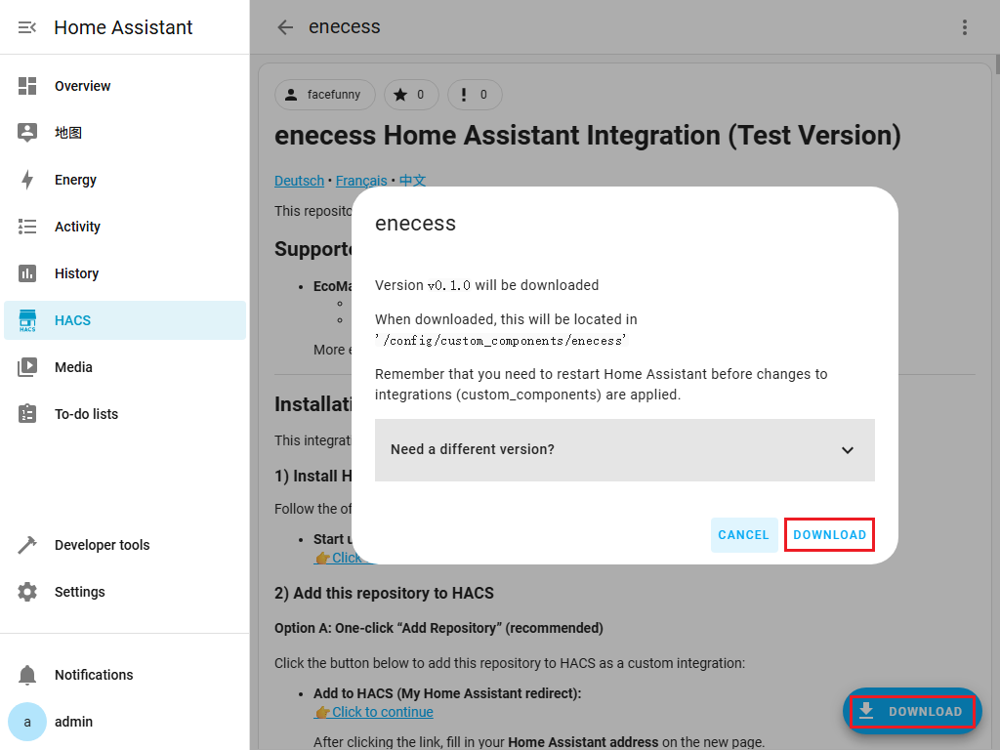
---
> 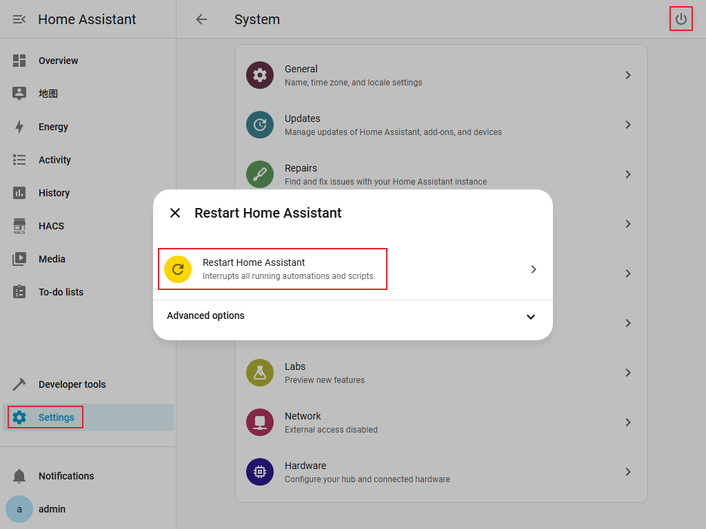

---

## Ajouter l’intégration dans Home Assistant

Il existe **deux façons** de lancer le flux de configuration pour EcoMain :

### Méthode 1 : via « Ajouter une intégration » (démarrage manuel)

1. Allez dans **Paramètres → Appareils et services**.
2. Cliquez sur **Ajouter une intégration**.
3. Recherchez **enecess**.
4. Sélectionnez le type d’appareil : **EcoMain**.
5. Choisissez une méthode d’ajout :
    - **Découverte automatique (local)**
    - **Configuration manuelle (local)**
    - **Connexion au compte (cloud)**

> **Capture d’écran du processus :**  
> 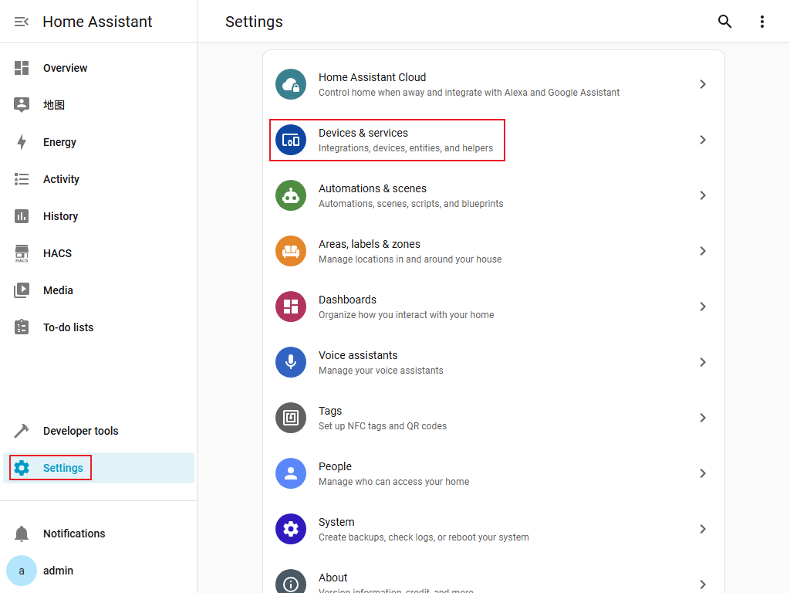
---
> 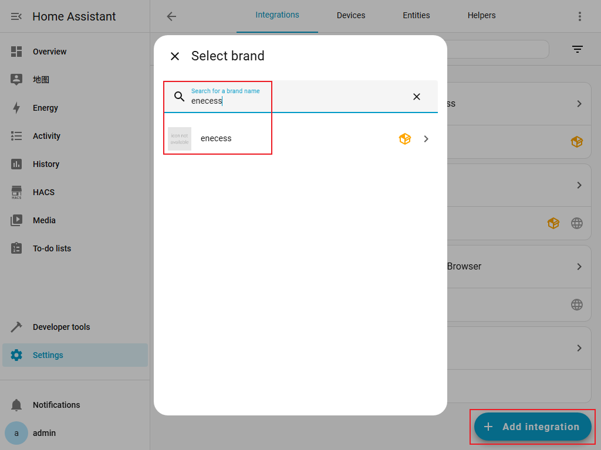
---
> 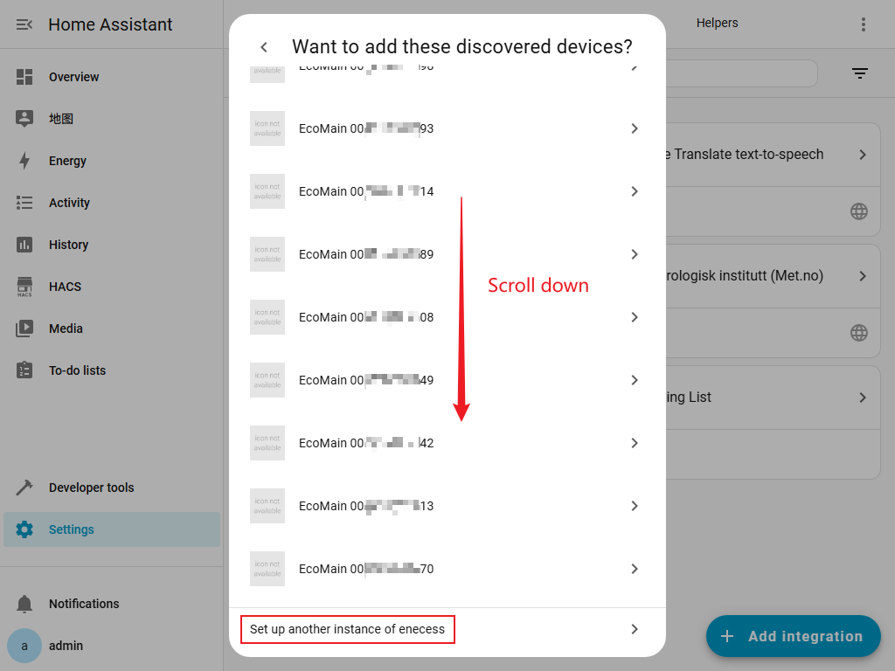
---
> 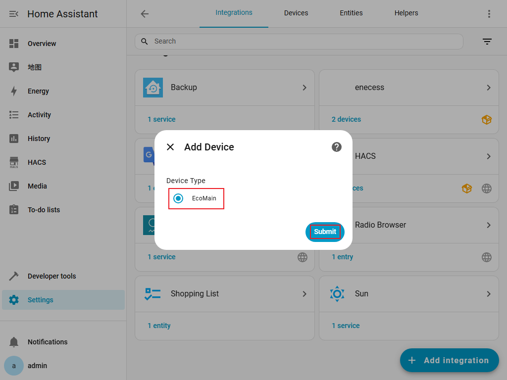
---
> 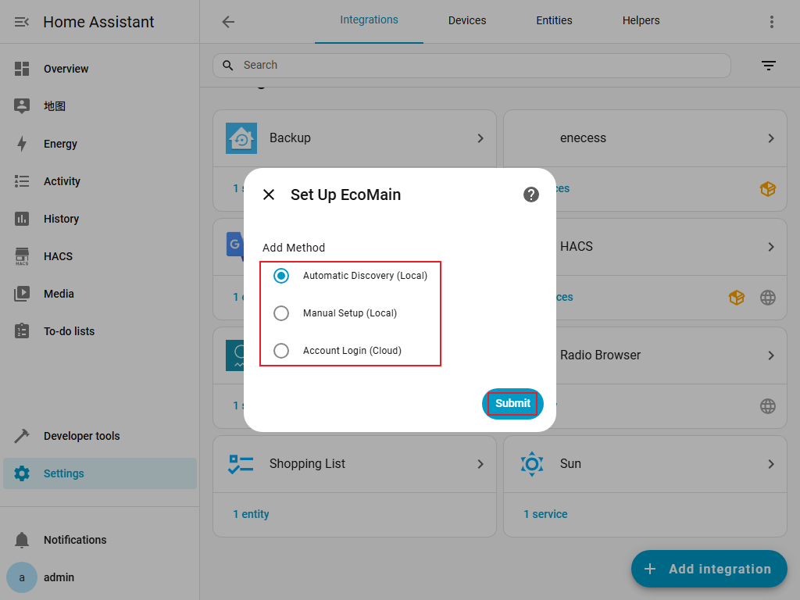

### Méthode 2 : via la section « Découverts » (zeroconf / découverte mDNS)

Cette intégration prend en charge la découverte **zeroconf (mDNS)**.  
Lorsque votre EcoMain est sous tension et sur le même réseau que Home Assistant :

1. Allez dans **Paramètres → Appareils et services**.
2. Dans la section **Découverts**, vous devriez voir un appareil **enecess / EcoMain**.
3. Cliquez sur **Add** / **Ajouter** sur la carte correspondante.
4. L’intégration lancera automatiquement le flux de configuration en utilisant la méthode **Découverte automatique (local)**, avec le numéro de série et l’adresse IP
   détectés.
5. Continuez avec les étapes de **Découverte automatique (local)** décrites ci-dessous (sélection des esclaves, confirmation, fin).

> **Capture d’écran du processus :**  
> 
---
> 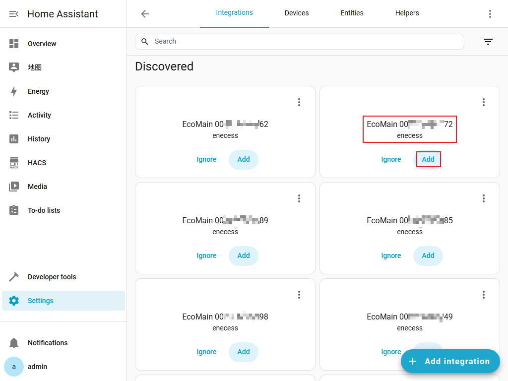
---
> 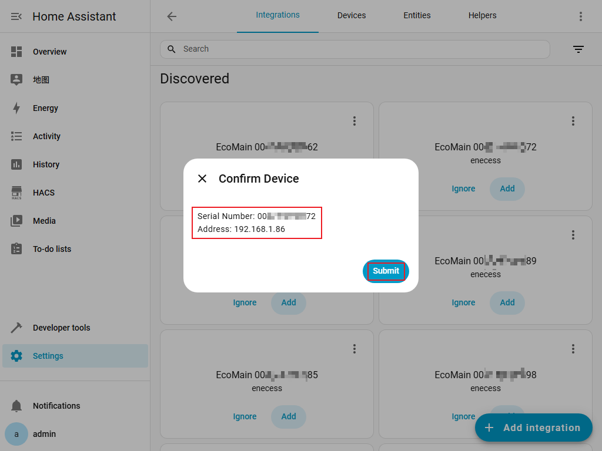

---

## Méthodes d’ajout EcoMain & déroulement détaillé

EcoMain peut être ajouté de trois manières :

1. **Découverte automatique (local)**
    - Lancement possible :
        - « Ajouter une intégration » → enecess → EcoMain → Méthode : *Découverte automatique (local)*
        - Ou en cliquant sur une carte EcoMain **découverte automatiquement** (zeroconf) dans la page des appareils et services.
2. **Configuration manuelle (local)**
3. **Connexion au compte (cloud)**

### A) Découverte automatique (local)

À utiliser si :

- Votre EcoMain est sur le même LAN que Home Assistant.
- La découverte mDNS/Bonjour/zeroconf fonctionne sur votre réseau.

Cette méthode couvre deux cas :

- **Démarrage manuel** : vous choisissez explicitement **Découverte automatique (local)**.
- **Démarrage depuis « Découverts »** : vous cliquez sur une carte EcoMain déjà détectée, l’intégration remplissant alors les informations (IP, numéro de série) à partir
  du zeroconf.

Étapes (identiques dans les deux cas) :

1. Lancez la configuration EcoMain :
    - Depuis **Ajouter une intégration → enecess → EcoMain → Découverte automatique (local)**,
    - Ou en cliquant sur **Add** / **Ajouter** sur la carte EcoMain dans la section **Découverts**.
2. L’intégration scanne le réseau via **mDNS** pour trouver les services correspondants.
3. Si des appareils sont trouvés, sélectionnez le bon EcoMain par **numéro de série** (et IP/nom d’hôte affichés).
4. Confirmez les informations de l’appareil (numéro de série et adresse).
5. L’intégration vérifie d’abord la **version du firmware** de l’appareil, puis tente de se connecter via **Modbus TCP** et de détecter les **modules esclaves (EcoSub)**
   en ligne.
6. Si des esclaves sont détectés, choisissez ceux que vous souhaitez ajouter (facultatif).
7. Terminez pour créer l’entrée d’intégration.

Conseils en cas de problème :

- Si aucun appareil n’est trouvé via mDNS, essayez la **configuration manuelle (local)**.
- Vérifiez que Home Assistant et EcoMain sont sur le même sous-réseau/VLAN.
- Certains routeurs bloquent le multicast/mDNS entre les segments Wi-Fi/ethernet.

> **Capture d’écran du processus :**  
> 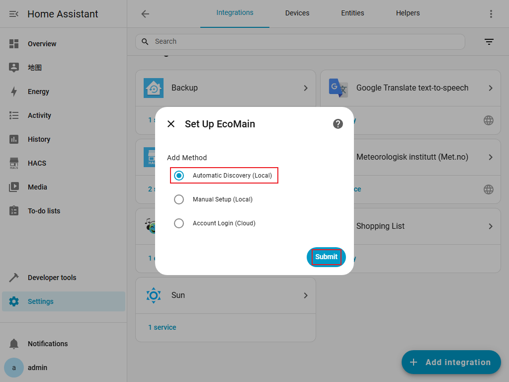
---
> 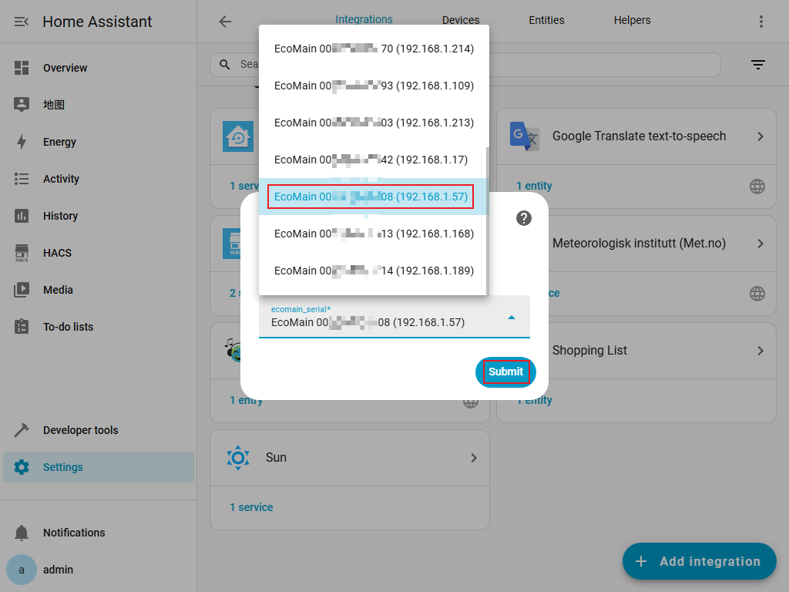
---
> 
---
> 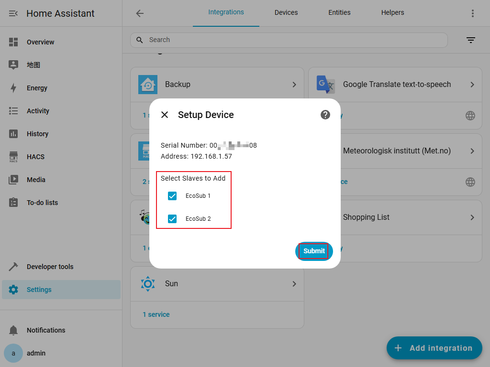
---
> 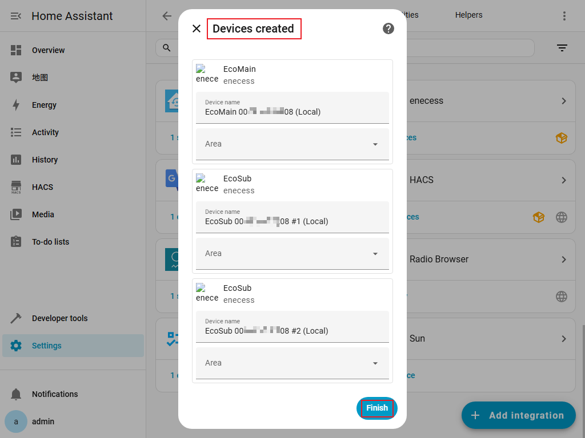

---

### B) Configuration manuelle (local)

À utiliser si :

- La découverte automatique ne trouve pas votre appareil.
- Vous connaissez déjà l’adresse IP/nom d’hôte et le numéro de série d’EcoMain.

Avant de commencer :

- Récupérez l’**adresse IP** d’EcoMain (depuis votre routeur/DHCP, ou l’interface réseau de l’appareil).
- Préparez le **numéro de série du maître**.

Étapes :

1. Dans le flux d’intégration, sélectionnez :
    - Type d’appareil : **EcoMain**
    - Méthode : **Configuration manuelle (local)**
2. Saisissez :
    - **Numéro de série du maître**
    - **Adresse (IP ou nom d’hôte)**
3. Confirmez les informations de l’appareil.
4. L’intégration va d’abord vérifier la **version du firmware**, puis se connecter via **Modbus TCP** et détecter les **modules esclaves (EcoSub)** en ligne.
5. Si des esclaves sont détectés, sélectionnez ceux que vous souhaitez ajouter (facultatif).
6. Terminez pour créer l’entrée d’intégration.

Conseils en cas de problème :

- Vérifiez que Home Assistant peut joindre l’adresse IP (même réseau, règles de routage/pare-feu).
- Le port Modbus TCP est **502** (défini dans l’intégration ; non modifiable via l’interface).
- Si la connexion échoue, revérifiez IP/nom d’hôte et les règles réseau.

> **Capture d’écran du processus :**  
> 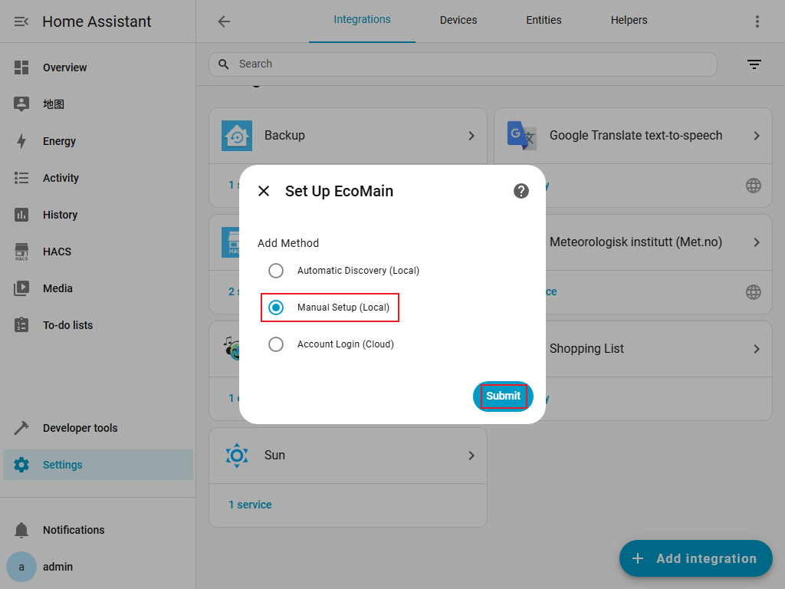
---
> 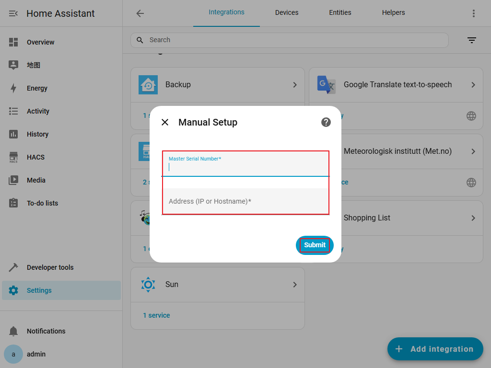
---
> 
---
> 
---
> 

---

### C) Connexion au compte (cloud)

À utiliser si :

- Vous souhaitez lire les données d’EcoMain via le **cloud enecess**.
- Votre EcoMain est déjà enregistré dans votre **compte de l’application enecess**.

> **Important :** la connexion cloud utilise **exactement le même compte et le même mot de passe** que l’**application enecess** (Android / iOS). Aucun nouveau compte
> n’est créé ici.

Étapes :

1. Dans le flux d’intégration, sélectionnez :
    - Type d’appareil : **EcoMain**
    - Méthode : **Connexion au compte (cloud)**
2. Saisissez vos identifiants de compte cloud (les mêmes que pour l’**application enecess**) :
    - **Nom d’utilisateur**
    - **Mot de passe**
3. L’intégration se connecte et récupère la liste des maîtres EcoMain disponibles.
4. Sélectionnez le maître EcoMain à ajouter.
5. Si le compte cloud contient des appareils EcoSub, l’intégration les lira et vous proposera de sélectionner les esclaves à ajouter (facultatif).
6. Terminez pour créer l’entrée d’intégration.

Remarques :

- Les données cloud sont des valeurs **traitées** côté serveur, en fonction de la configuration distante.
- L’intervalle de mise à jour cloud est généralement plus lent que le local (`~60 s` contre `~5 s`).

> **Capture d’écran du processus :**  
> 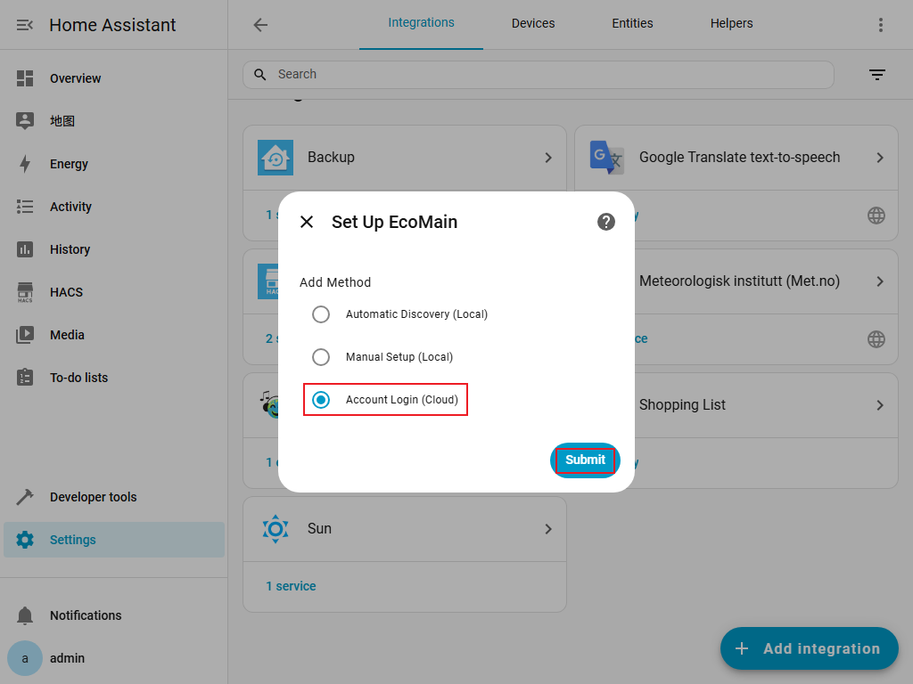
---
> 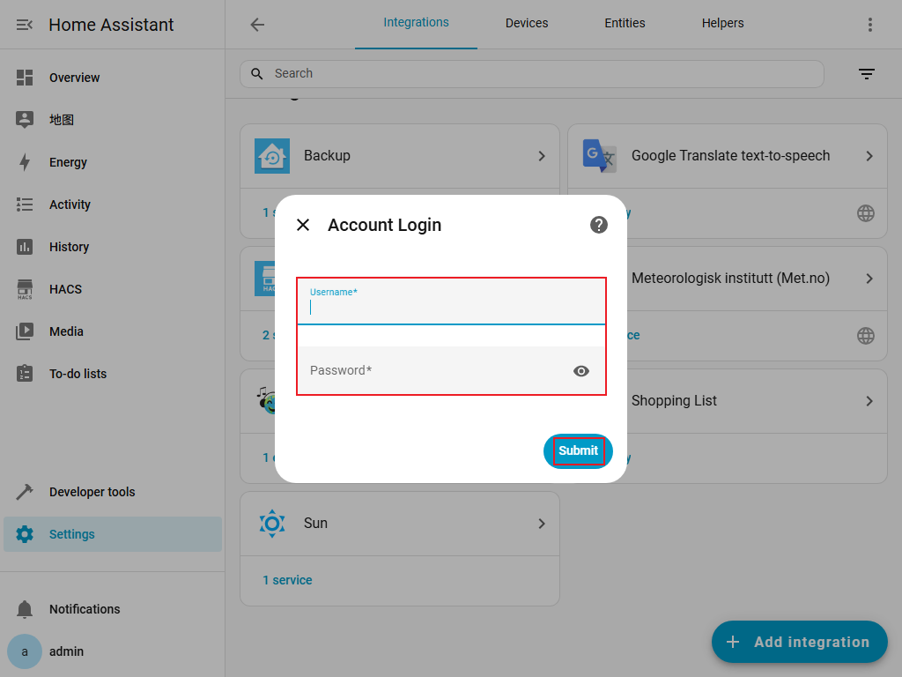
---
> 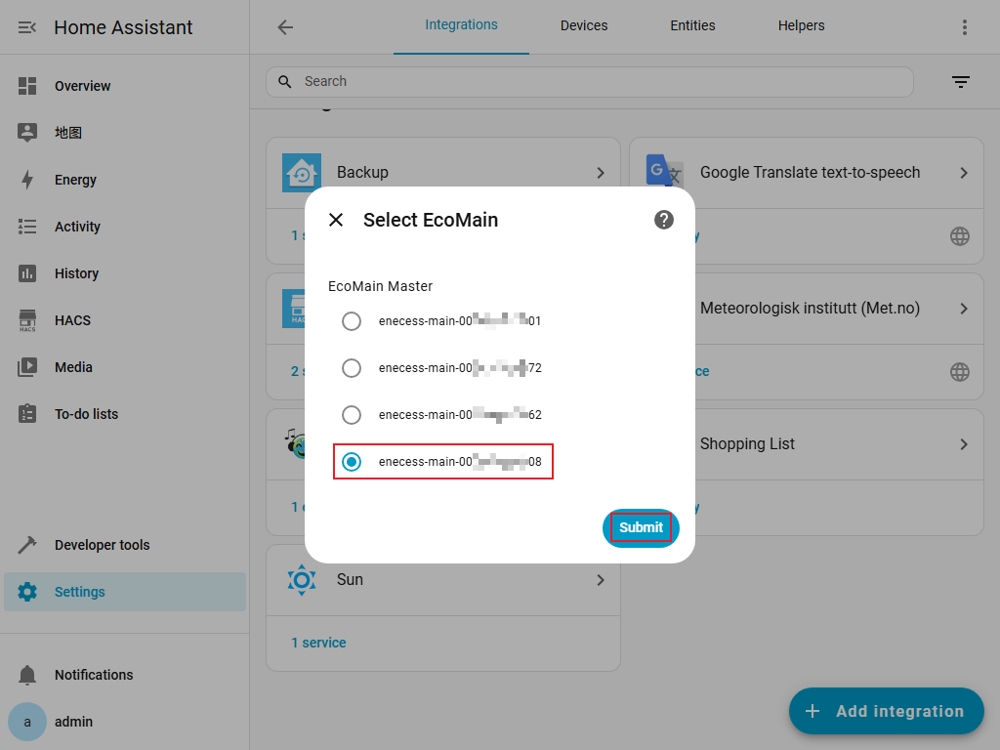
---
> 
---
> 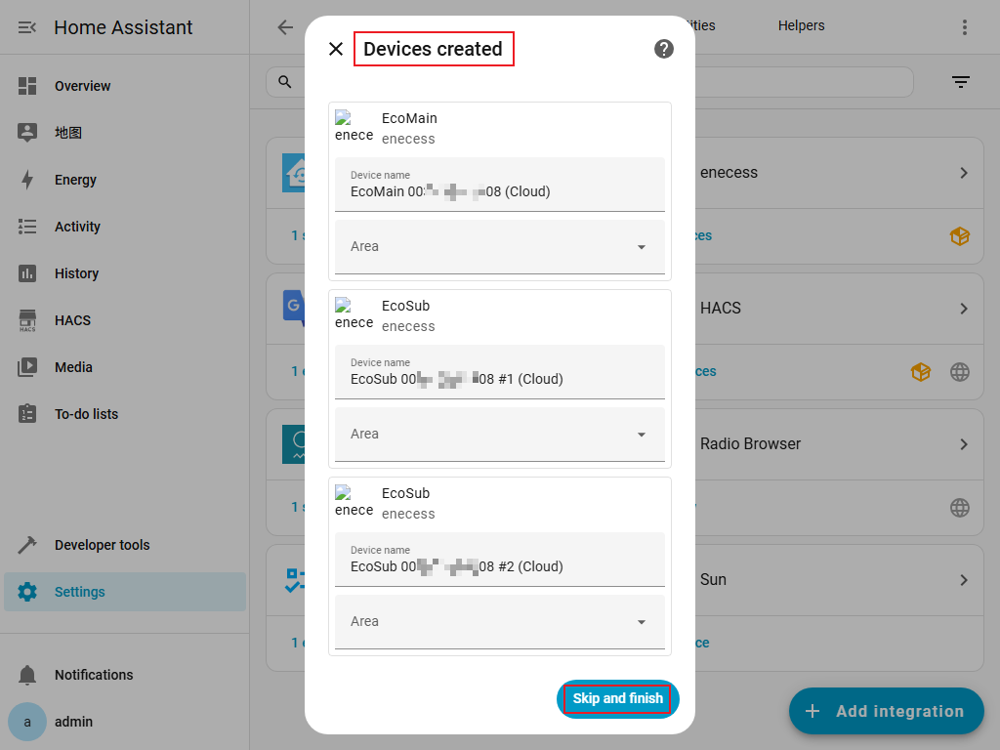

---

## Limitations actuelles / Points importants

### Pas de « modifier » / « options » pour les entrées existantes (pour l’instant)

Une fois l’entrée d’intégration créée, **il n’existe actuellement aucun écran d’options pour la modifier** (changer l’hôte, la méthode d’ajout, la liste d’esclaves,
etc.).

Si vous devez changer la configuration :

1. Allez dans **Paramètres → Appareils et services**.
2. Recherchez **enecess**.
3. Supprimez l’entrée d’intégration.
4. Ajoutez-la à nouveau avec les bons paramètres.

> Une gestion d’options est prévue pour une version ultérieure.

### Avertissement : version de test

Cette intégration est une **version de test** :

- Des bugs imprévus peuvent subsister.
- La logique de mise à jour/migration n’est pas totalement finalisée.
- Une mise à jour de test peut rendre une entrée existante invalide et nécessiter de **ré-ajouter** l’intégration.
- La version minimale de firmware EcoMain prise en charge peut évoluer dans le futur.

---

## Nom des appareils

Lorsqu’une entrée d’intégration est créée, le titre suit ce format :

- **Mode local :** `EcoMain <numéro_de_série> (Local)`
- **Mode cloud :** `EcoMain <numéro_de_série> (Cloud)`

Exemples :

- `EcoMain 12345678 (Local)`
- `EcoMain 12345678 (Cloud)`

---

## Nom des entités & signification

Les entités sont créées sous forme de capteurs, avec des clés prédictibles.  
Le nom de l’entité est égal à la clé du capteur.

### Schéma de nommage

- **Maître (EcoMain) :** `main_...`
- **Esclave (EcoSub #) :** `sub<indice_esclave>_...` (ex : `sub1_...`, `sub2_...`, `sub3_...`)
- **Canaux :** `ch1` à `ch10`

### Entités en mode local (Modbus)

En mode local, les entités incluent :

- **Puissance instantanée L1/L2/L3 du maître**
- **Puissance instantanée totale (L1+L2+L3) du maître**
- **Énergie totale L1/L2/L3 en sens avant/arrière**
- **Énergie totale (L1+L2+L3) en sens avant/arrière**
- **10 canaux de dérivation du maître (ch1–ch10) :**
    - puissance instantanée
    - énergie totale en sens avant
    - énergie totale en sens inverse
- **Esclaves (EcoSub) : uniquement canaux (ch1–ch10) :**
    - puissance instantanée
    - énergie totale en sens avant
    - énergie totale en sens inverse

#### Signification des suffixes (mode local)

- `_rt` = **valeur temps réel**
- `fwd_total` = **énergie cumulée en sens avant (positif)**
- `rev_total` = **énergie cumulée en sens inverse (négatif)**

#### Sens de la pince ampèremétrique (CT)

Chaque canal est associé à un **transformateur de courant (CT)**.  
La pince comporte généralement une **flèche** indiquant le sens de référence. Si le courant mesuré circule **dans le sens de la flèche**, il est considéré comme *
*avant/positif** ; dans le sens opposé, il est **inverse/négatif**.

Donc :

- `*_energy_fwd_total` = énergie cumulée lorsque le courant est dans le **sens de la flèche**.
- `*_energy_rev_total` = énergie cumulée lorsque le courant est en **sens inverse**.

#### Exemples (local)

Temps réel maître :

- `main_l1_power_rt`
- `main_l2_power_rt`
- `main_l3_power_rt`
- `main_all_power_rt`

Énergie totale maître :

- `main_all_energy_fwd_total`
- `main_all_energy_rev_total`

Canaux maître :

- `main_ch1_power_rt`
- `main_ch1_energy_fwd_total`
- `main_ch1_energy_rev_total`

Canaux esclave :

- `sub1_ch1_power_rt`
- `sub1_ch1_energy_fwd_total`
- `sub1_ch1_energy_rev_total`

---

### Entités en mode cloud

En mode cloud, les entités incluent :

- **Somme maîtres (L1+L2+L3) uniquement :**
    - puissance moyenne sur 1 minute
    - énergie cumulée sur 1 minute
- **10 canaux de dérivation du maître (ch1–ch10) :**
    - puissance moyenne sur 1 minute
    - énergie cumulée sur 1 minute
- **Esclaves (EcoSub) : uniquement canaux (ch1–ch10) :**
    - puissance moyenne sur 1 minute
    - énergie cumulée sur 1 minute

> Les valeurs cloud sont **traitées et renvoyées par le service distant**, en fonction de la configuration enregistrée dans votre compte.

#### Signification des suffixes (mode cloud)

- `avg_1m` = **moyenne sur 1 minute**
- `total_1m` = **cumul sur 1 minute**

#### Exemples (cloud)

Maître total :

- `main_all_power_avg_1m`
- `main_all_energy_total_1m`

Canaux maître :

- `main_ch1_power_avg_1m`
- `main_ch1_energy_total_1m`

Canaux esclave :

- `sub1_ch1_power_avg_1m`
- `sub1_ch1_energy_total_1m`

---

## FAQ / Dépannage

### Q1 : EcoMain n’apparaît pas dans la liste des appareils « Découverts »

**Causes possibles :**

- EcoMain et Home Assistant ne sont pas sur le même sous-réseau/VLAN.
- Le trafic multicast / mDNS est bloqué par votre routeur ou pare-feu.

**Que faire :**

1. Vérifiez que Home Assistant et EcoMain sont sur le même segment réseau.
2. Vérifiez la configuration du routeur pour autoriser le multicast/mDNS entre interfaces.
3. Si la découverte échoue toujours, utilisez la **configuration manuelle (local)** et saisissez l’IP et le numéro de série.

---

### Q2 : J’obtiens « No compatible devices found » (`no_devices_found`)

Cette erreur peut apparaître dans plusieurs cas :

- La découverte automatique s’est terminée sans trouver d’EcoMain.
- La connexion cloud a réussi, mais aucun maître EcoMain n’est associé à votre compte.
- Le maître sélectionné dans le flux cloud ne renvoie aucune donnée valide.

**Que faire :**

- Pour le **local** :
    - Vérifiez qu’EcoMain est alimenté et connecté au LAN.
    - Essayez la **configuration manuelle (local)** avec une adresse IP connue.
- Pour le **cloud** :
    - Connectez-vous à l’application ou au portail enecess et vérifiez qu’EcoMain est bien ajouté à votre **compte enecess App**.

---

### Q3 : J’obtiens « Unable to connect to device » (`cannot_connect_local`)

Cette erreur survient lorsque le client Modbus local n’arrive pas à lire les registres de l’appareil (après la vérification de firmware).

**Causes courantes :**

- Adresse IP/nom d’hôte incorrect.
- Port 502 bloqué par un pare-feu.
- EcoMain n’est pas joignable depuis le réseau de Home Assistant.
- EcoMain redémarre ou est dans un état anormal.

**Que faire :**

1. Confirmez que l’IP/nom d’hôte d’EcoMain est correct.
2. Testez un ping vers cette IP depuis un autre appareil du même réseau.
3. Vérifiez que le port **TCP 502** n’est pas bloqué.
4. Coupez puis remettez l’alimentation d’EcoMain et réessayez.

---

### Q4 : J’obtiens « Device firmware version is too old » (`firmware_too_old`)

Lors de l’ajout en mode local, l’intégration lit d’abord un **registre de version firmware**. Si :

- La version est **inférieure** au minimum requis, ou
- L’intégration n’arrive pas à lire correctement la version,

vous verrez l’erreur : **« Device firmware version is too old »** (`firmware_too_old`).

**Ce que cela signifie :**

- Le firmware d’EcoMain n’est pas compatible avec cette version de l’intégration.
- L’appareil peut utiliser un firmware ancien ou non supporté.

**Que faire :**

1. Mettez EcoMain à jour avec le **firmware le plus récent** via les outils/procédures officielles enecess (application, logiciel, etc.).
2. Une fois la mise à jour effectuée, réessayez d’ajouter l’intégration en mode local.
3. Si vous ne savez pas comment mettre à jour le firmware, contactez votre installateur ou le support enecess et mentionnez que l’intégration Home Assistant renvoie
   `firmware_too_old`.

> Remarque : dans certains cas, si le registre de version ne peut pas être lu, l’intégration le traite également comme `firmware_too_old`. Si vous êtes certain que le
> firmware est à jour, vérifiez aussi la connectivité (IP, port, câblage).

---

### Q5 : J’obtiens « Unable to connect to the cloud service » (`cannot_connect`)

Cela signifie que l’intégration n’a pas pu joindre le serveur cloud enecess.

**Causes possibles :**

- Home Assistant n’a pas d’accès Internet.
- La résolution DNS échoue.
- Le point de terminaison cloud (`https://hems.enecess.com`) est temporairement indisponible.

**Que faire :**

1. Vérifiez que Home Assistant a accès à Internet.
2. Depuis le même réseau, testez l’URL cloud dans un navigateur ou avec `curl`.
3. Réessayez plus tard si le problème semble temporaire.

---

### Q6 : J’obtiens « Invalid username or password » (`auth_failed`)

La connexion cloud a échoué car les identifiants ont été rejetés par l’API enecess.

**Important :** l’intégration utilise **strictement le même compte que l’application enecess**. Si vos identifiants ne fonctionnent pas dans l’appli, ils ne
fonctionneront pas non plus ici.

**Que faire :**

1. Revérifiez le nom d’utilisateur et le mot de passe (ceux de l’application enecess).
2. Essayez de vous connecter à l’application / au portail web enecess avec ces identifiants.
3. Si cela échoue aussi, réinitialisez votre mot de passe dans l’application/portail, puis mettez-le à jour dans l’intégration.

---

### Q7 : Je vois « This device has already been configured » (`already_configured`)

L’intégration utilise un **identifiant unique** par EcoMain et par mode :

- Mode local : `ecomain:<serial>:mode_local`
- Mode cloud : `ecomain:<serial>:mode_cloud`

Si une entrée avec le même ID existe déjà, vous ne pouvez pas l’ajouter une seconde fois.

**Que faire :**

- Allez dans **Paramètres → Appareils et services**.
- Repérez l’entrée enecess / EcoMain avec le même numéro de série.
- Supprimez-la si vous souhaitez reconfigurer, puis relancez le flux d’ajout.

---

### Q8 : Je ne peux pas changer l’hôte, les esclaves sélectionnés ou la méthode d’ajout après la configuration

Pour l’instant, il n’y a **pas de flux d’options** pour les entrées existantes. C’est une limitation connue de cette version de test.

**Pour modifier la configuration :**

1. Allez dans **Paramètres → Appareils et services**.
2. Repérez l’entrée enecess concernée.
3. Supprimez-la.
4. Ajoutez une nouvelle entrée avec les paramètres mis à jour (hôte, mode, esclaves, etc.).

---

### Q9 : Après une mise à jour de l’intégration, mon entrée ne fonctionne plus

Cette intégration est une **version de test**. La logique de migration n’est pas entièrement en place et des changements incompatibles sont possibles.

Si une mise à jour introduit une rupture :

**Que faire :**

1. Supprimez l’entrée enecess existante.
2. Ajoutez-la à nouveau avec la version actuelle de l’intégration.

---

### Q10 : Pourquoi je ne vois que certains esclaves ou canaux ?

L’intégration applique plusieurs filtres :

1. **Esclaves supportés** : seuls les indices d’esclaves définis dans la configuration sont pris en charge (actuellement `1`, `2`, `3`).
2. **Esclaves en ligne** (mode local) :
    - L’intégration lit des registres « esclaves en ligne ».
    - Seuls les esclaves marqués comme en ligne sont proposés.
3. **Esclaves sélectionnés** :
    - Seuls les esclaves que vous avez choisis dans le formulaire sont réellement créés en entités.

Vous verrez donc des entités pour :

- Des indices d’esclaves supportés
- Détectés comme en ligne (local)
- Et que vous avez explicitement sélectionnés

Si des sous-appareils manquent :

- Vérifiez que les esclaves sont alimentés et correctement câblés.
- Supprimez puis ré-ajoutez l’intégration en incluant les esclaves manquants.

---

### Q11 : Pourquoi certaines valeurs sont toujours nulles ou négatives ?

Plusieurs raisons possibles :

- **Sens du CT** :
    - Si la flèche de la pince est inversée, la « direction avant » pourra rester faible ou nulle, tandis que la « direction inverse » accumulera l’énergie.
    - Vérifiez l’installation physique et assurez-vous que la flèche correspond au sens de courant souhaité.
- **Absence de charge** :
    - Si rien n’est branché ou si la charge est coupée, la puissance et l’énergie évolueront très peu.
- **Cloud vs local** :
    - En mode cloud, les données sont moyennées (`avg_1m`) et cumulées par minute (`total_1m`), elles évoluent donc plus lentement.

À retenir :

- `*_energy_fwd_total` : énergie cumulée lorsque le courant circule dans le **sens avant**.
- `*_energy_rev_total` : énergie cumulée lorsque le courant circule dans le **sens inverse**.

---

### Q12 : Pourquoi je n’ai pas d’entités L1/L2/L3 en mode cloud ?

C’est **normal** :

- En **mode local** (Modbus), l’intégration expose :
    - Les puissances/énergies L1, L2, L3
    - Les valeurs totales (L1+L2+L3)
- En **mode cloud**, l’intégration expose :
    - Les totaux (L1+L2+L3)
    - Les canaux (ch1–ch10)
    - Toutes ces valeurs sont des données traitées :
        - `*_avg_1m` (puissance moyenne sur 1 minute)
        - `*_total_1m` (énergie cumulée sur 1 minute)

Les données par phase ne sont pas fournies par le mapping actuel de l’API cloud.

---

### Q13 : À quelle fréquence les valeurs sont-elles mises à jour ?

- **Mode local** :
    - L’intégration lit périodiquement les registres Modbus (environ **toutes les 5 secondes** par défaut).
    - Les entités suffixées `_rt` se mettent à jour quasi en temps réel.
- **Mode cloud** :
    - L’intégration interroge le service cloud à un intervalle plus long (environ **toutes les 60 secondes**).
    - Les valeurs (`avg_1m`, `total_1m`) sont basées sur un traitement par minute côté serveur.

Ces intervalles pourront être ajustés dans les versions futures.

---

### Q14 : Comment mes identifiants cloud sont-ils stockés ?

Si vous utilisez la **Connexion au compte (cloud)**, l’intégration stocke :

- Le **nom d’utilisateur** cloud
- Le **mot de passe** cloud
- Le **jeton (token)** renvoyé par l’API

Ces informations sont conservées dans le stockage de configuration de Home Assistant (comme pour les autres intégrations) et servent à :

- Générer et rafraîchir les jetons d’accès
- Interroger vos maîtres et esclaves EcoMain dans le cloud

Si cela vous inquiète :

- Assurez-vous que votre instance Home Assistant est bien protégée (mot de passe fort, sauvegardes, etc.).
- Supprimez l’intégration si vous ne souhaitez plus que Home Assistant accède à votre compte cloud enecess.

---

## Support / Retours

Cette intégration est au stade initial. Si vous rencontrez des problèmes :

- Récupérez les journaux (logs) de Home Assistant.
- Indiquez la méthode d’ajout utilisée (local auto / local manuel / cloud).
- Précisez le modèle de votre appareil et votre environnement réseau.
- Mentionnez les messages d’erreur exacts (par ex. `cannot_connect_local`, `firmware_too_old`, `auth_failed`, etc.).
