# Integracja enecess dla Home Assistant (wersja testowa)

[English](README.md) • [Deutsch](README.de.md) • [Français](README.fr.md) • [中文](README.zh-CN.md)

To repozytorium udostępnia niestandardową integrację Home Assistant (HA) dla produktów marki **enecess**.

> **Wymagania dotyczące oprogramowania układowego (tryb lokalny):** Lokalna konfiguracja EcoMain przez Modbus TCP wymaga wersji oprogramowania układowego **136 lub nowszej**. Jeśli wersja jest starsza albo urządzenie nie udostępnia zgodnego rejestru wersji oprogramowania, integracja wyświetli komunikat **Wersja oprogramowania urządzenia jest zbyt stara**. Ta lokalna kontrola wersji nie dotyczy trybu chmurowego.

## Obsługiwane urządzenia

- **EcoMain**
    - Lokalnie (Modbus TCP, z wykrywaniem zeroconf / mDNS)
    - Chmura (Enecess cloud)
- **EcoPlug**
    - Tylko chmura (Enecess cloud)
    - Jeden wpis konta może wybrać wiele gniazdek według nazwy i numeru seryjnego.
    - W **Konfiguruj / Opcje** można później zmienić wybór.

---

## Instalacja (niestandardowe repozytorium HACS)

Integracja jest przeznaczona do instalacji przez **HACS** jako **niestandardowe repozytorium**.

### 1) Zainstaluj HACS (jeśli nie jest jeszcze zainstalowany)

Skorzystaj z oficjalnego przewodnika HACS:

- **Start using HACS**  
  [👉Kliknij, aby kontynuować](https://hacs.xyz/docs/use/)

### 2) Dodaj to repozytorium do HACS

#### Opcja A: Jedno kliknięcie „Add Repository” (zalecane)

Kliknij poniższy przycisk, aby dodać to repozytorium do HACS jako niestandardową integrację:

- **Add to HACS (przekierowanie My Home Assistant):**  
  [👉Kliknij, aby kontynuować](https://my.home-assistant.io/redirect/hacs_repository/?owner=enecess&repository=ha-enecess&category=integration)

> Po kliknięciu linku wpisz adres swojego Home Assistant na nowej stronie.

> **Zrzut ekranu procesu:**  
> 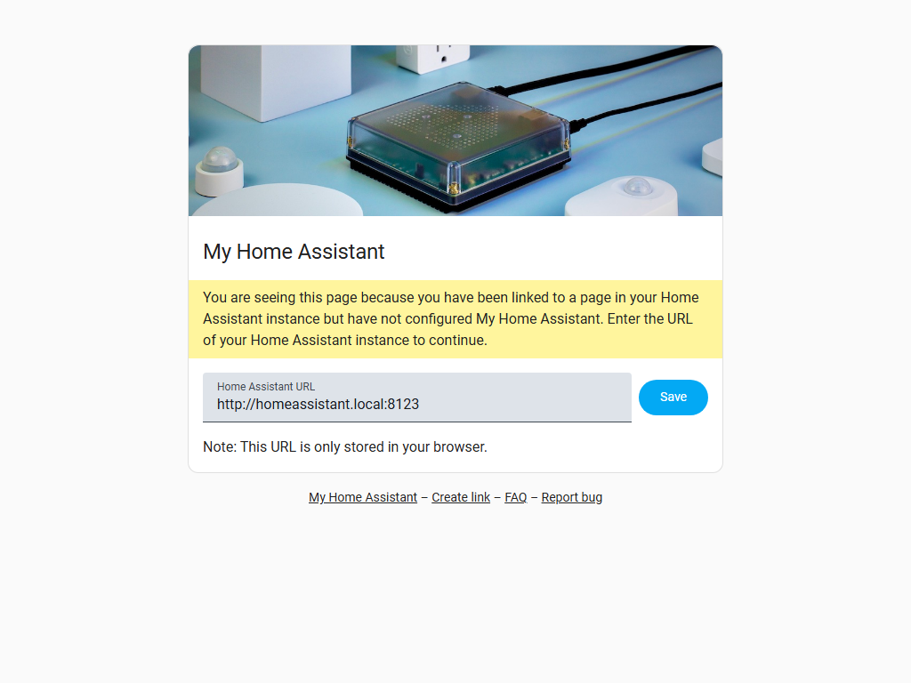

#### Opcja B: Dodanie ręczne w HACS

1. Otwórz Home Assistant.
2. Przejdź do **HACS**.
3. Otwórz menu w prawym górnym rogu -> **Custom repositories**.
4. Wklej adres repozytorium, np. `https://github.com/enecess/ha-enecess`.
5. Kategoria: **Integration**
6. Kliknij **Add**.

> **Zrzut ekranu procesu:**  
> 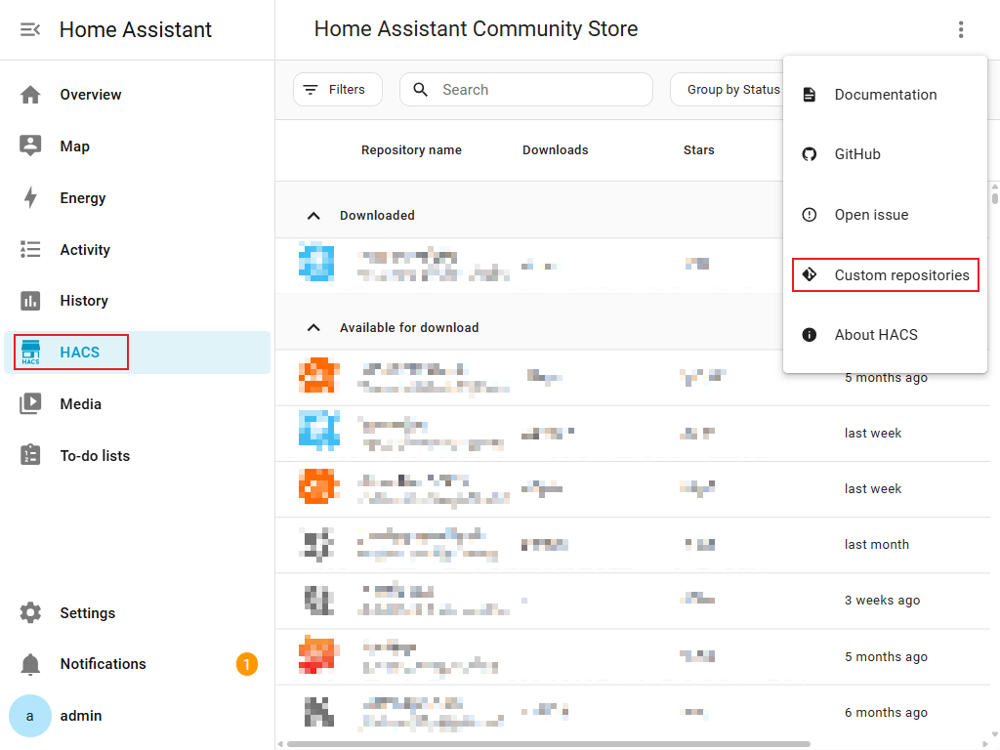
---
> 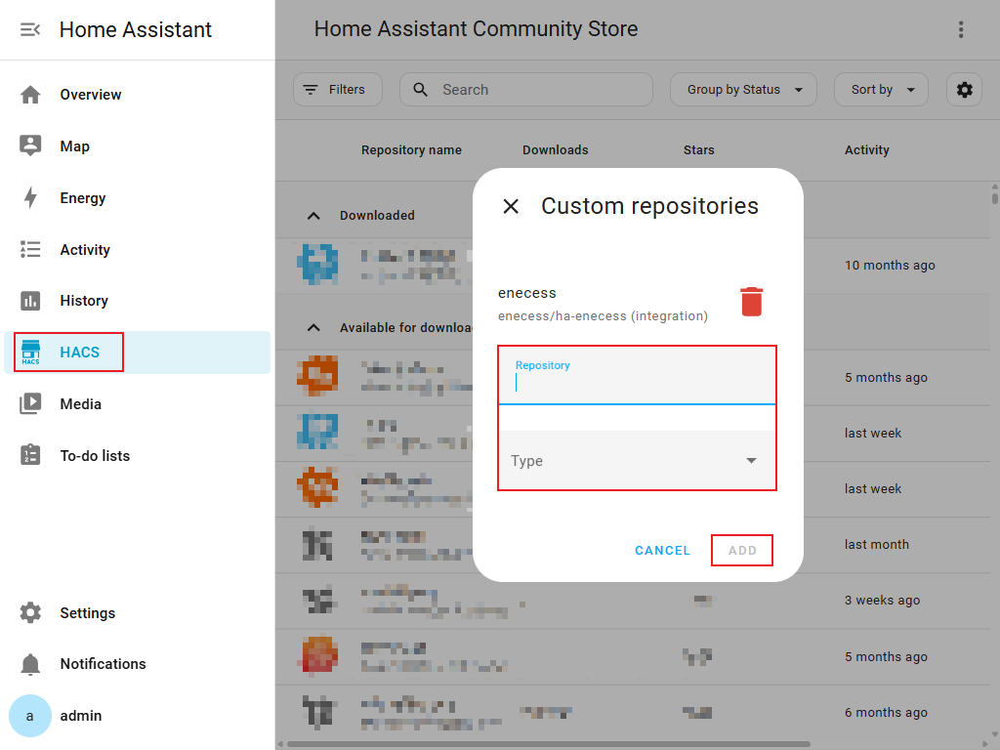

### 3) Pobierz / zainstaluj integrację z HACS

1. W HACS przejdź do **Integrations**.
2. Wyszukaj **enecess**.
3. Otwórz integrację i kliknij **Download**.
4. Po zakończeniu zrestartuj Home Assistant:
    - Settings -> System -> Restart

> **Zrzut ekranu procesu:**  
> 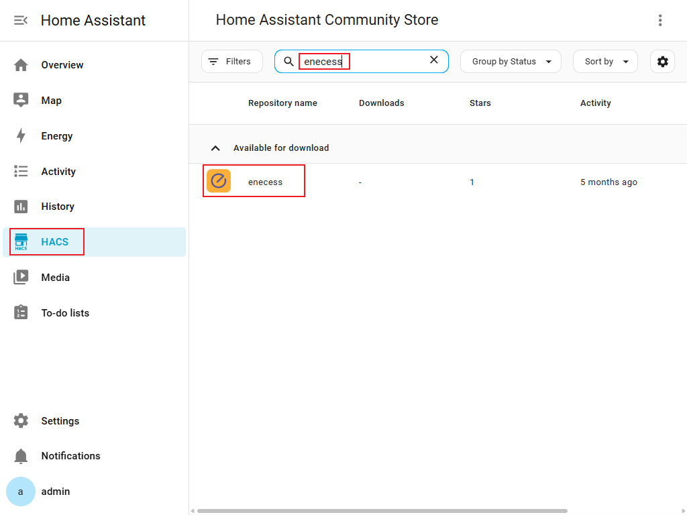
---
> 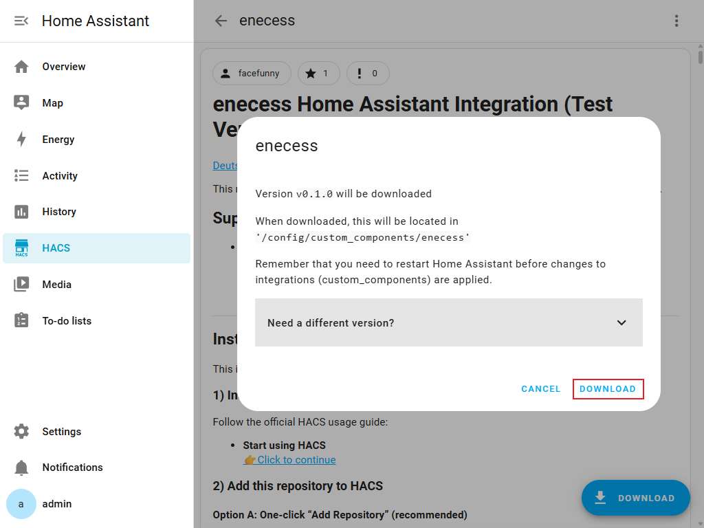
---
> 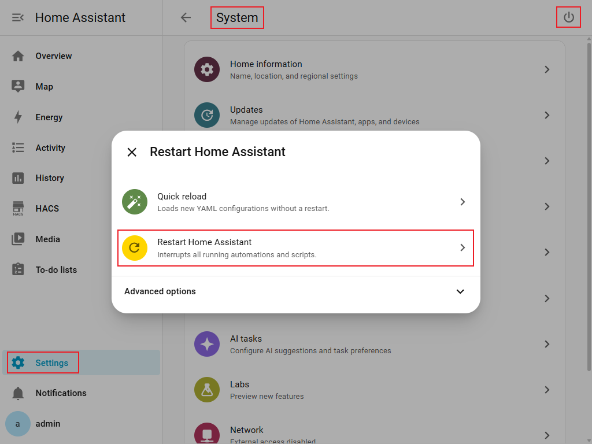

---

## Dodawanie integracji w Home Assistant

Istnieją dwa sposoby uruchomienia konfiguracji EcoMain:

### Sposób 1: Z sekcji „Discovered” (automatyczne wykrywanie zeroconf / mDNS)

Integracja obsługuje skanowanie **zeroconf** (mDNS).  
Gdy EcoMain jest włączony i znajduje się w tej samej sieci co Home Assistant:

1. Przejdź do **Settings -> Devices & services**.
2. W sekcji **Discovered** powinna pojawić się karta urządzenia **enecess** / **EcoMain**.
3. Kliknij **Add** na wykrytej karcie.
4. Integracja uruchomi konfigurację automatycznie, używając trybu **Automatic Discovery (Local)** z wykrytym numerem seryjnym i adresem IP.
5. Kontynuuj kroki dla **Automatic Discovery (Local)** opisane poniżej: wybór urządzeń podrzędnych, potwierdzenie i zakończenie.

> **Zrzut ekranu procesu:**  
> 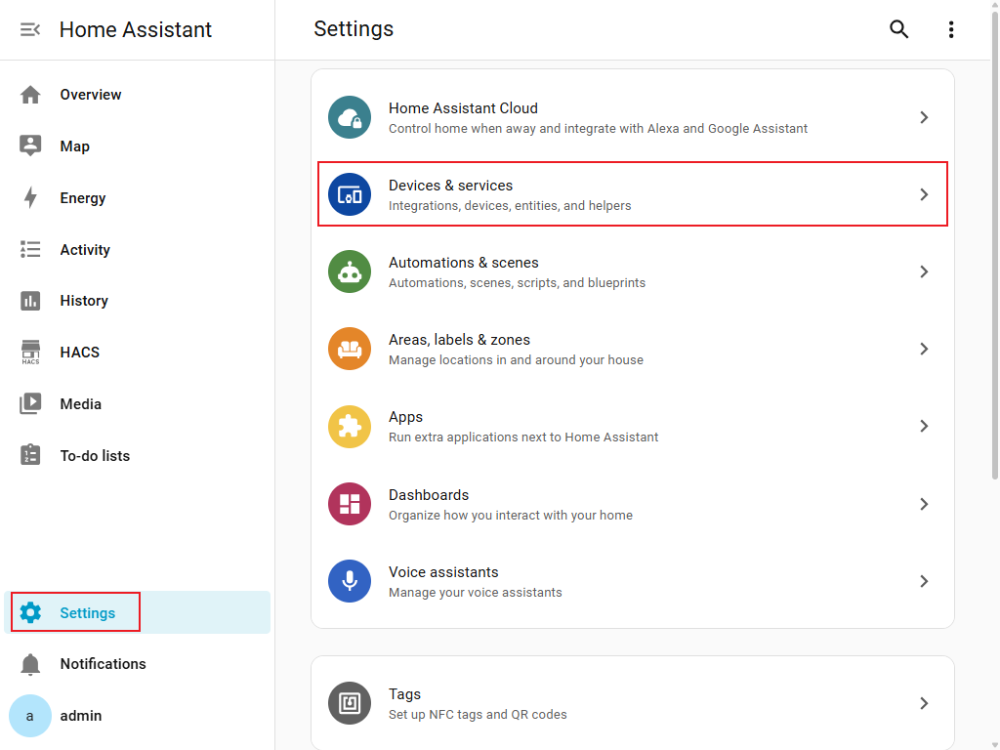
---
> 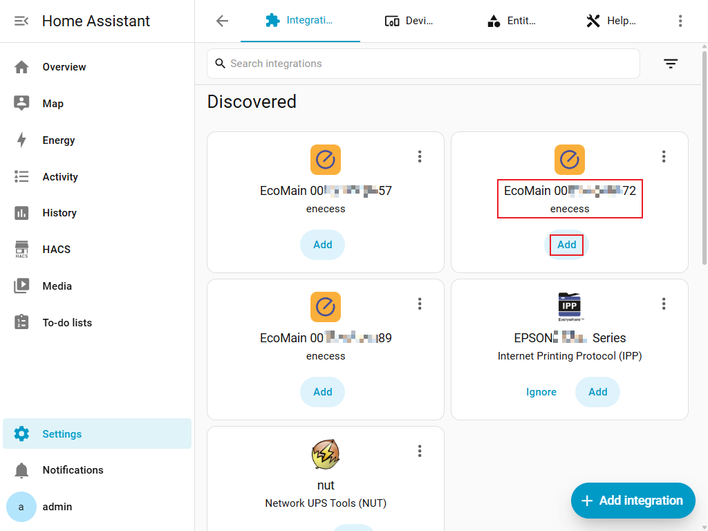
---
> 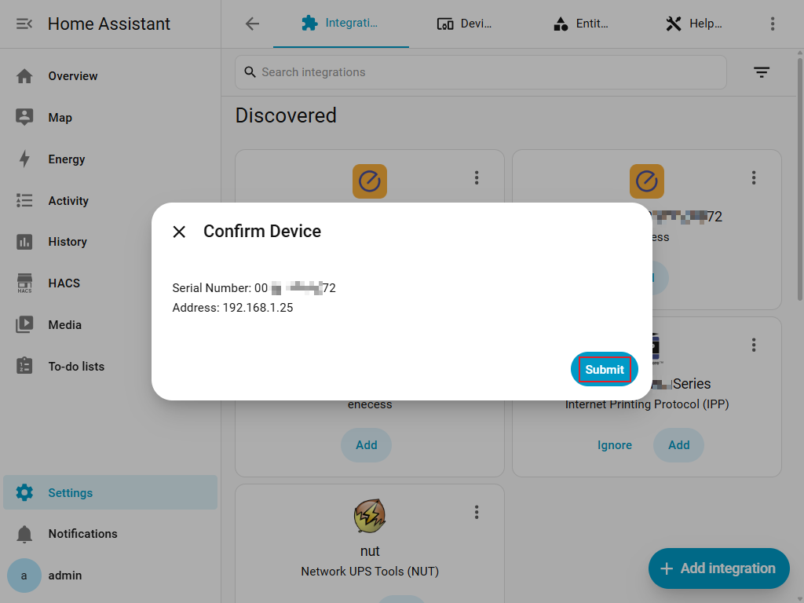

### Sposób 2: Z „Add Integration” (uruchomienie ręczne)

1. Przejdź do **Settings -> Devices & services**.
2. Kliknij **Add Integration**.
3. Wyszukaj **enecess**.
4. Wybierz typ urządzenia: **EcoMain**.
5. Wybierz metodę dodawania:
    - **Automatic Discovery (Local)**
    - **Manual Setup (Local)**
    - **Account Login (Cloud)**

> **Zrzut ekranu procesu:**  
> 
---
> 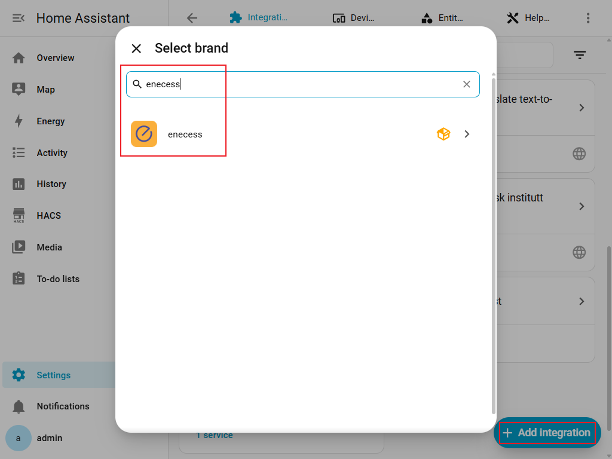
---
> 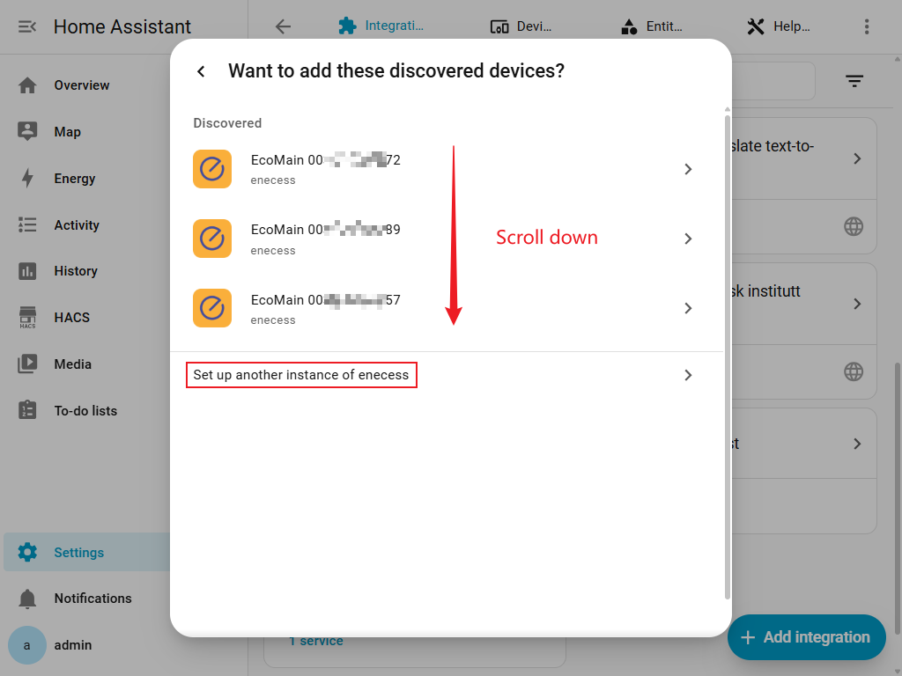
---
> 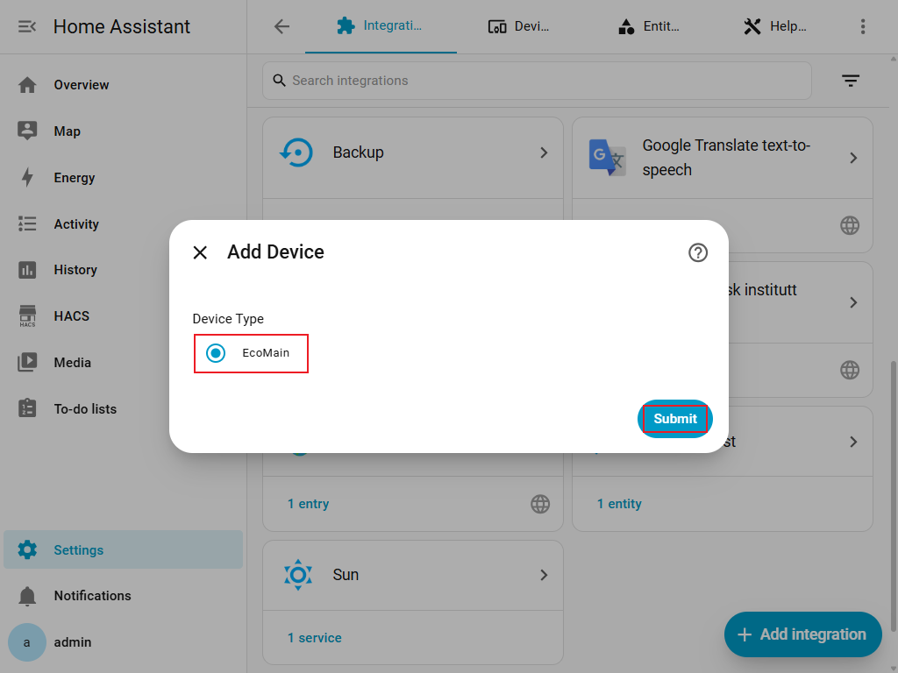
---
> 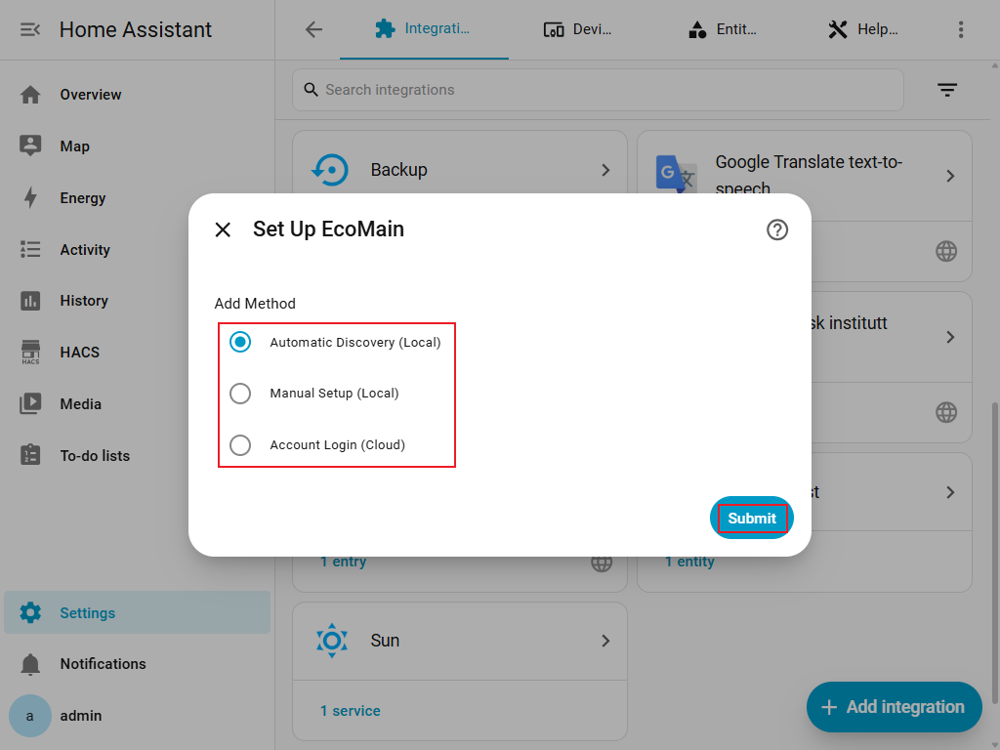
---

## Metody dodawania EcoMain i przebieg konfiguracji

EcoMain można dodać na trzy sposoby:

1. **Automatic Discovery (Local)**
    - Można uruchomić z:
        - „Add Integration” -> enecess -> EcoMain -> Add Method: *Automatic Discovery (Local)*
        - albo przez kliknięcie wykrytej karty **EcoMain** na stronie Devices & services.
2. **Manual Setup (Local)**
3. **Account Login (Cloud)**

### A) Automatic Discovery (Local)

Użyj tej metody, gdy:

- EcoMain znajduje się w tej samej sieci LAN co Home Assistant.
- mDNS/Bonjour/zeroconf działa poprawnie w Twojej sieci.

Ta metoda występuje w dwóch scenariuszach:

- **Start ręczny**: wybierasz **Automatic Discovery (Local)** jako metodę dodawania.
- **Start z wykrycia**: klikasz kartę wykrytego **EcoMain** na stronie Devices & services.  
  Integracja automatycznie wypełni numer seryjny i IP z informacji zeroconf, a następnie przejdzie przez ten sam przepływ konfiguracji.

Kroki:

1. Uruchom konfigurację EcoMain:
    - z **Add Integration -> enecess -> EcoMain -> Automatic Discovery (Local)**,
    - albo klikając **Add** na wykrytej karcie **EcoMain**.
2. Integracja przeskanuje sieć przez **mDNS**.
3. Jeśli urządzenia zostaną znalezione, wybierz właściwy EcoMain po **numerze seryjnym** oraz widocznym IP/hostname.
4. Potwierdź informacje o urządzeniu.
5. Integracja najpierw sprawdzi **wersję firmware**, a następnie spróbuje połączyć się przez **Modbus TCP** i wykryć online urządzenia podrzędne **EcoSub**.
6. Jeśli EcoSub zostaną wykryte, wybierz urządzenia podrzędne do dodania (opcjonalnie).
7. Opcjonalnie skonfiguruj **Extra Entities**:
    - utwórz encje odwrócone lub z wartością bezwzględną z istniejących źródeł mocy,
    - utwórz encje sumy lub średniej z wielu źródeł mocy albo energii tego samego typu,
    - encje agregujące zachowują `device_class`, `state_class` i jednostkę natywną źródeł.
8. Zakończ, aby utworzyć wpis integracji.

Wskazówki diagnostyczne:

- Jeśli mDNS nie wykrywa urządzenia, użyj **Manual Setup (Local)**.
- Upewnij się, że Home Assistant i EcoMain są w tej samej podsieci/VLAN.
- Niektóre routery blokują multicast/mDNS między segmentami Wi-Fi/Ethernet.

> **Zrzut ekranu procesu:**  
> 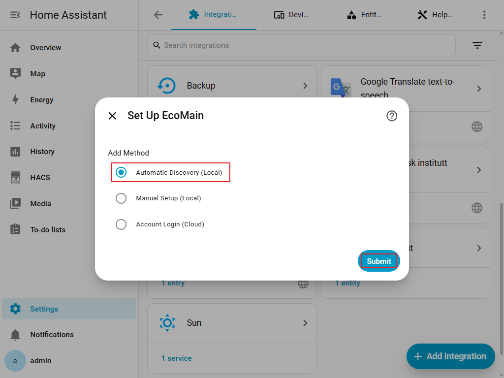
---
> 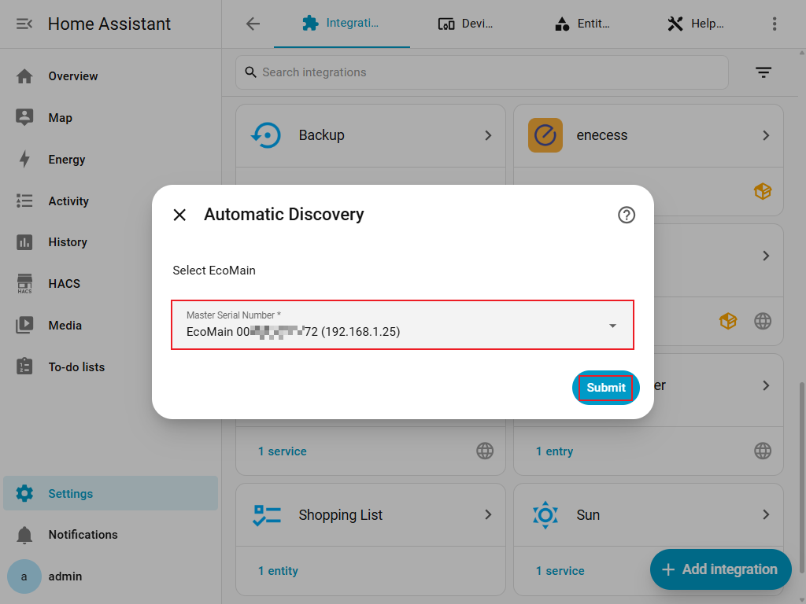
---
> 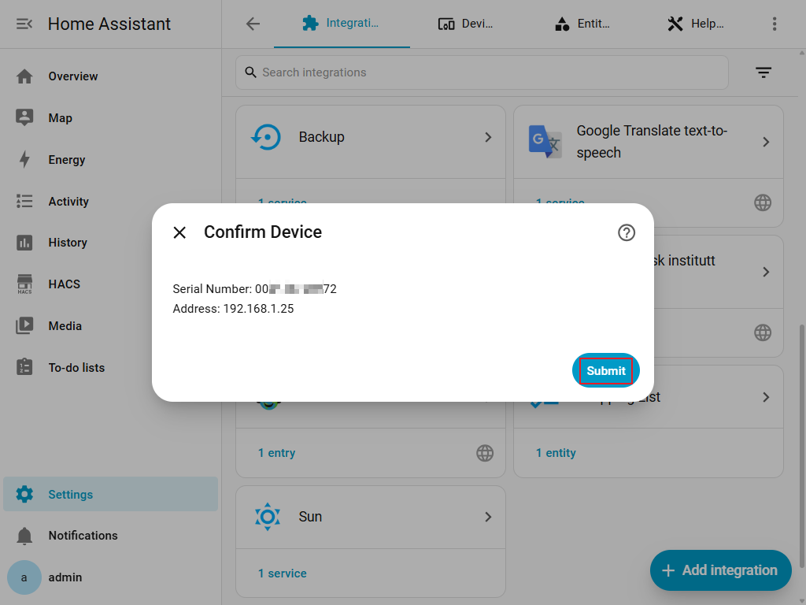
---
> 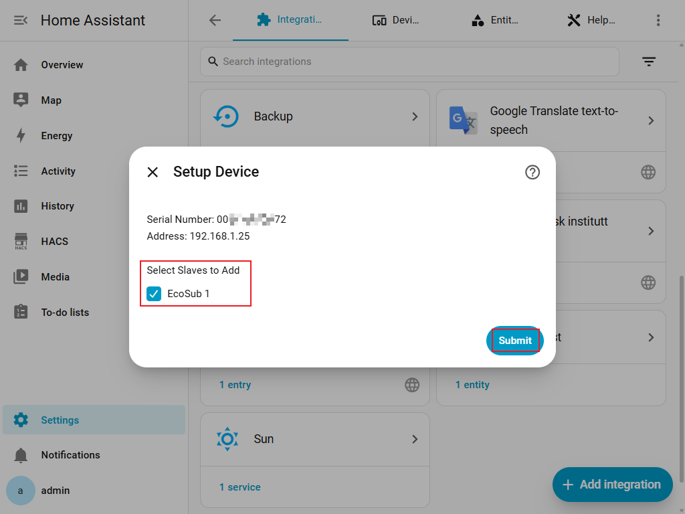
---
> 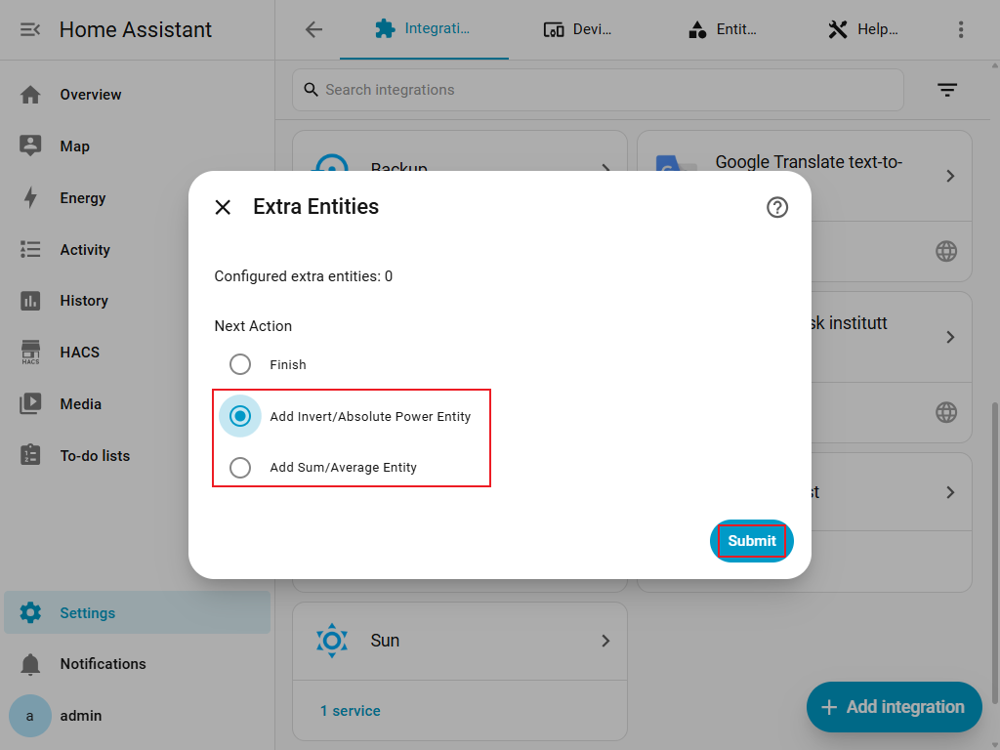
---
> 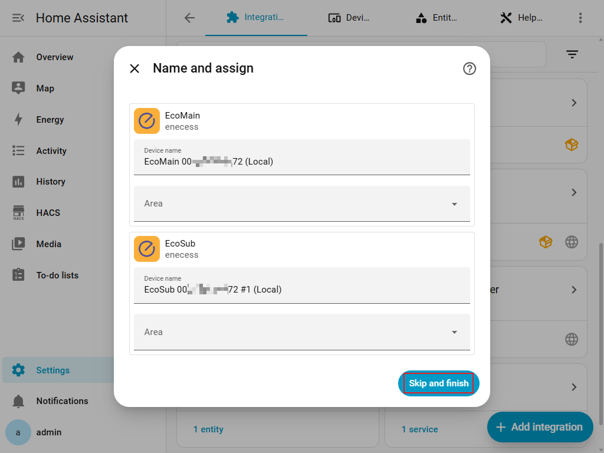

---

### B) Manual Setup (Local)

Użyj tej metody, gdy:

- automatyczne wykrywanie nie znajduje urządzenia,
- znasz adres IP/hostname EcoMain oraz jego numer seryjny.

Przed rozpoczęciem:

- znajdź adres **IP** EcoMain w routerze / liście DHCP albo w ustawieniach urządzenia,
- przygotuj **numer seryjny urządzenia głównego**.

Kroki:

1. W przepływie konfiguracji wybierz:
    - Device Type: **EcoMain**
    - Add Method: **Manual Setup (Local)**
2. Wpisz:
    - **Master Serial Number**
    - **Address (IP or Hostname)**
3. Potwierdź informacje o urządzeniu.
4. Integracja najpierw sprawdzi **wersję firmware**, a następnie połączy się przez **Modbus TCP** i wykryje online urządzenia **EcoSub**.
5. Jeśli EcoSub zostaną wykryte, wybierz urządzenia podrzędne do dodania (opcjonalnie).
6. Opcjonalnie skonfiguruj **Extra Entities**:
    - utwórz encje odwrócone lub z wartością bezwzględną z istniejących źródeł mocy,
    - utwórz encje sumy lub średniej z wielu źródeł mocy albo energii tego samego typu,
    - encje agregujące zachowują `device_class`, `state_class` i jednostkę natywną źródeł.
7. Zakończ, aby utworzyć wpis integracji.

Wskazówki diagnostyczne:

- Sprawdź, czy Home Assistant może połączyć się z IP urządzenia.
- Domyślny port Modbus TCP to **502** i jest stały w integracji.
- Jeśli połączenie nie działa, sprawdź IP/hostname oraz dostęp sieciowy.

> **Zrzut ekranu procesu:**  
> 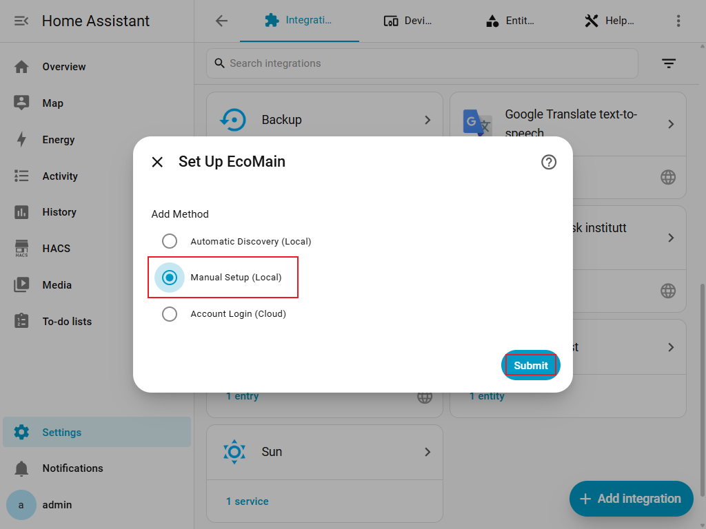
---
> 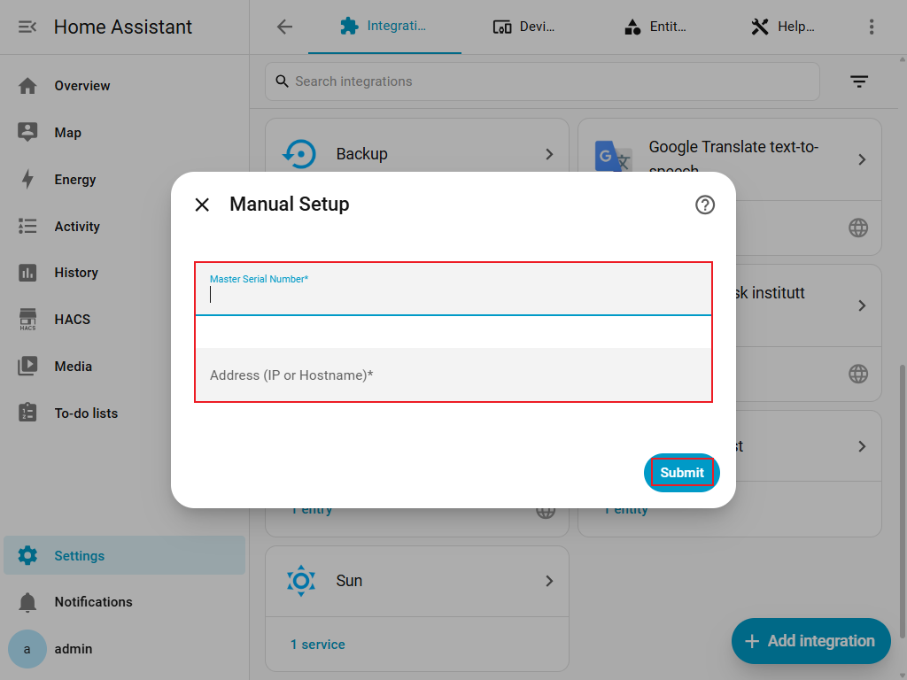
---
> 
---
> 
---
> 
---
> 

---

### C) Account Login (Cloud)

Użyj tej metody, gdy:

- chcesz odczytywać dane EcoMain przez **Enecess cloud**,
- EcoMain jest już przypisany do konta w oficjalnej aplikacji **enecess App**.

> **Ważne:** logowanie do chmury używa tego samego konta i hasła co oficjalna aplikacja **enecess App** (Android / iOS). Nie tworzy nowego konta.

Kroki:

1. W przepływie konfiguracji wybierz:
    - Device Type: **EcoMain**
    - Add Method: **Account Login (Cloud)**
2. Wpisz dane konta chmurowego:
    - **Username**
    - **Password**
3. Integracja zaloguje się i wyświetli dostępne urządzenia główne EcoMain.
4. Wybierz EcoMain, który chcesz dodać.
5. Jeśli konto chmurowe ma urządzenia EcoSub, integracja odczyta je i pozwoli wybrać urządzenia podrzędne (opcjonalnie).
6. Opcjonalnie skonfiguruj **Extra Entities**:
    - utwórz encje odwrócone lub z wartością bezwzględną z istniejących źródeł mocy,
    - utwórz encje sumy lub średniej z wielu źródeł mocy albo energii tego samego typu,
    - encje agregujące zachowują `device_class`, `state_class` i jednostkę natywną źródeł.
7. Zakończ, aby utworzyć wpis integracji.

Uwagi:

- Dane z chmury są wartościami przetworzonymi na podstawie konfiguracji zdalnej.
- Interwał odświeżania w chmurze jest zwykle wolniejszy niż lokalne odpytywanie (`~60s` zamiast `~5s`).

> **Zrzut ekranu procesu:**  
> 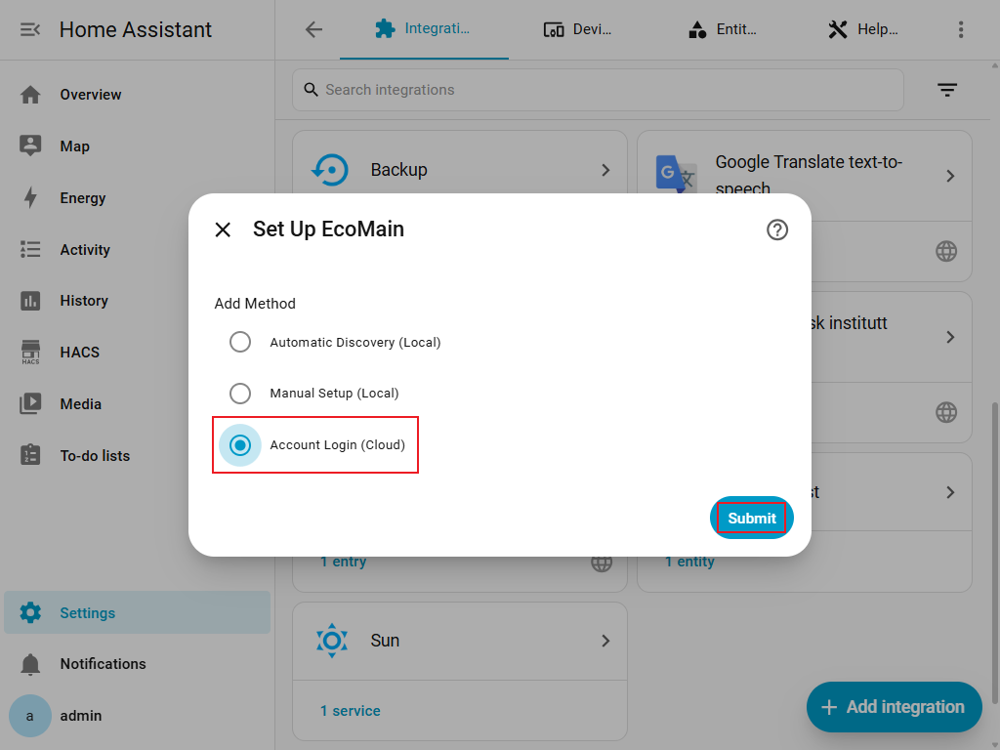
---
> 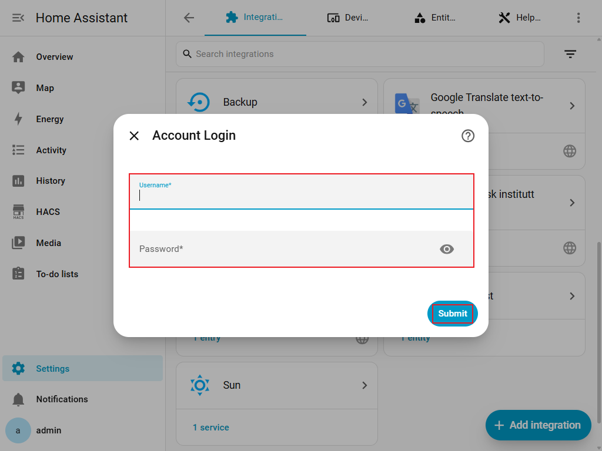
---
> 
---
> 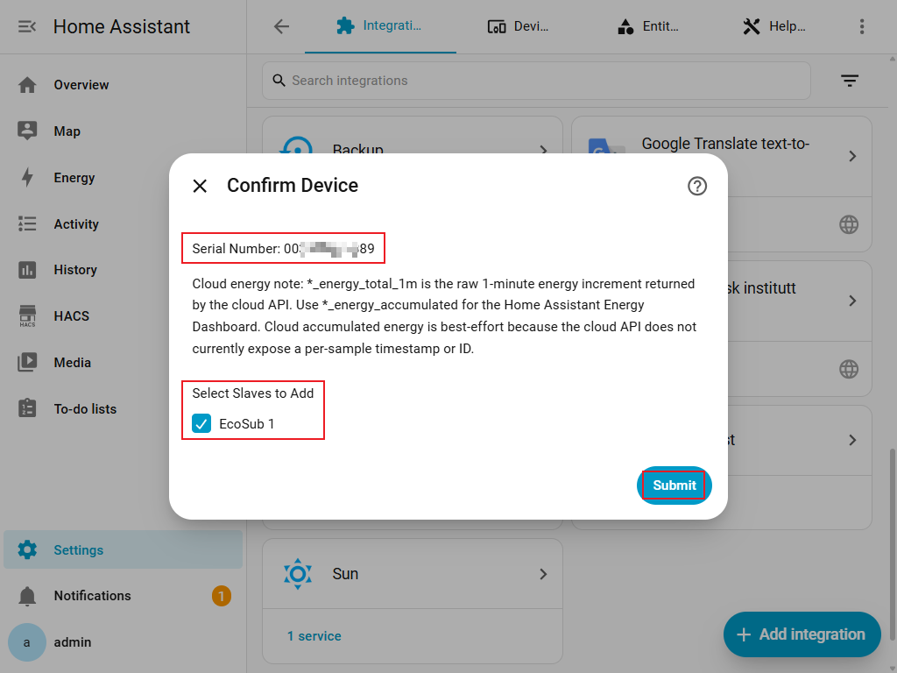
---
> 
---
> 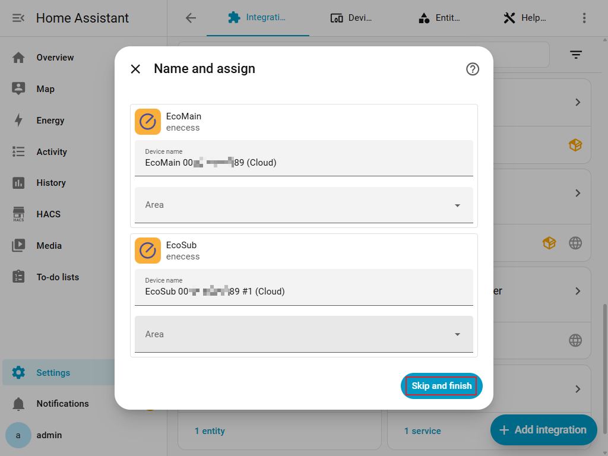

---

## Konfiguracja EcoPlug w chmurze i zachowanie encji

EcoPlug jest obsługiwany **wyłącznie przez chmurę Enecess**. Integracja nie udostępnia lokalnej konfiguracji EcoPlug ani konfiguracji dodatkowych encji.

Kroki:

1. Przejdź do **Ustawienia → Urządzenia i usługi → Dodaj integrację** i wybierz **enecess**.
2. Wybierz typ urządzenia **EcoPlug**.
3. Wpisz nazwę użytkownika i hasło używane przez konto enecess App.
4. Po zalogowaniu wybierz z listy **jedno lub więcej** gniazdek. Każda pozycja pokazuje nazwę i numer seryjny gniazdka.
5. Zakończ konfigurację, aby utworzyć jeden wpis integracji EcoPlug dla tego konta i wszystkich wybranych gniazdek.
6. Aby później zmienić wybór, otwórz **Ustawienia → Urządzenia i usługi → enecess → Konfiguruj**, dodaj lub usuń gniazdka i zapisz opcje.

Każdy wybrany EcoPlug tworzy dokładnie następujące encje:

- **Przełącznik** sterujący gniazdkiem przez chmurę.
- `power_rt`: czujnik mocy chwilowej w **W**.
- `energy_total`: czujnik energii całkowitej w **kWh**.

Integracja pobiera dane EcoPlug z chmury mniej więcej co **60 sekund**. Po pomyślnym wykonaniu polecenia stan przełącznika jest natychmiast aktualizowany do wartości docelowej zaakceptowanej przez chmurę. Późniejsze dane pobrane z chmury pozostają miarodajne i mogą skorygować stan, jeśli gniazdko lub chmura zgłosi inną wartość.

---

## Aktualne ograniczenia / ważne uwagi

### Edycja istniejącego wpisu

Otwórz **Settings -> Devices & services -> enecess -> Configure**, aby zmienić opcje, które mogą być edytowane.

Możesz zmienić:

- wybrane urządzenia podrzędne EcoSub,
- konfigurację Extra Entities.

Nie możesz zmienić:

- typu urządzenia,
- metody dodawania,
- wybranego urządzenia głównego EcoMain / numeru seryjnego.

> **Zrzut ekranu procesu:**  
> 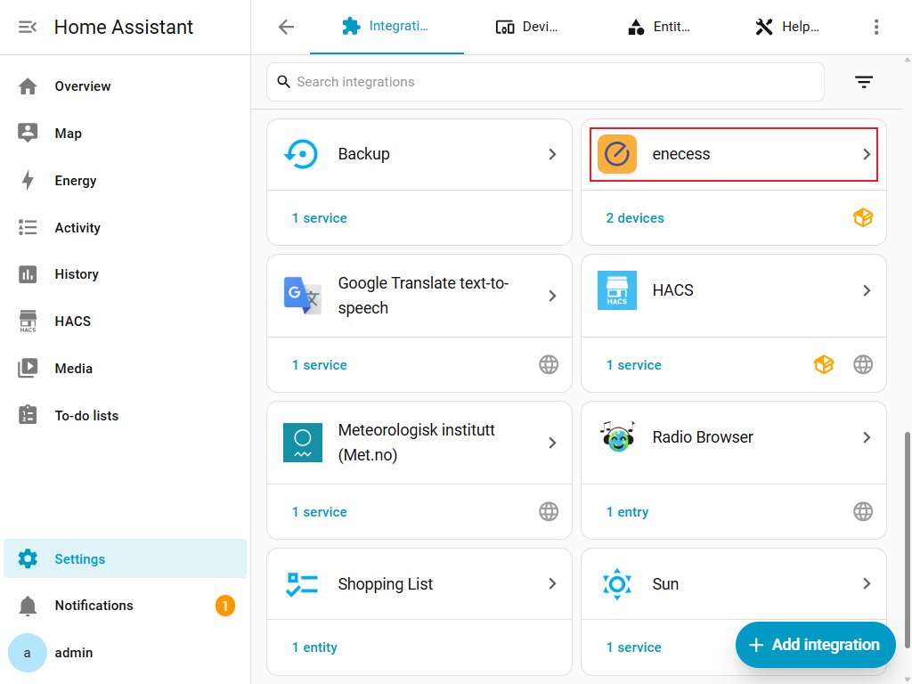
> 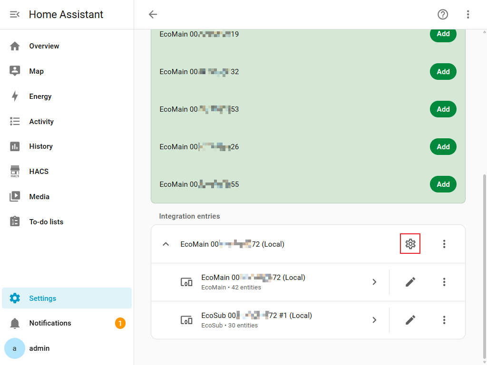
> 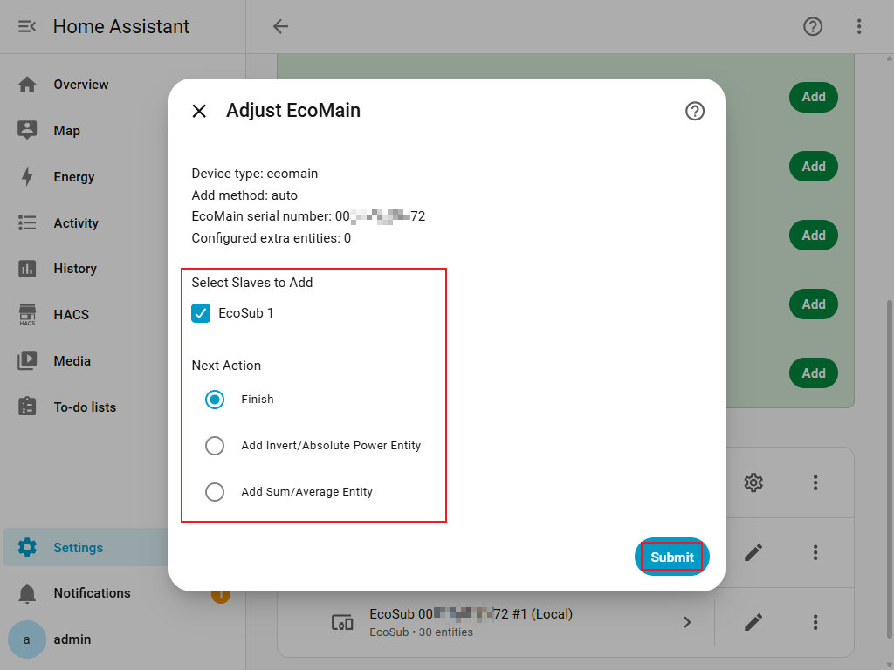

Jeśli chcesz zmienić ustawienia nieedytowalne:

1. Przejdź do **Settings -> Devices & services**.
2. Znajdź **enecess**.
3. Usuń wpis integracji.
4. Dodaj integrację ponownie z nowymi ustawieniami.

### Ostrzeżenie dotyczące wersji testowej

Integracja jest obecnie **wersją testową**:

- mogą występować nieoczekiwane błędy,
- logika aktualizacji i migracji nie jest jeszcze w pełni ustalona,
- aktualizacja testowa może spowodować, że istniejący wpis stanie się nieprawidłowy i będzie wymagał ponownego dodania,
- minimalna obsługiwana wersja firmware EcoMain może zmienić się w przyszłych wersjach.

---

## Nazewnictwo urządzeń

Po utworzeniu wpisu integracji tytuł ma następujący format:

- **Tryb lokalny:** `EcoMain <serial> (Local)`
- **Tryb chmury:** `EcoMain <serial> (Cloud)`

Przykład:

- `EcoMain 12345678 (Local)`
- `EcoMain 12345678 (Cloud)`

---

## Nazewnictwo i znaczenie encji

Encje są tworzone jako sensory z przewidywalnymi kluczami. Nazwa encji jest równa kluczowi sensora.

### Wspólny wzorzec nazw

- **Główne urządzenie (EcoMain):** `main_...`
- **Urządzenie podrzędne (EcoSub #):** `sub<slave_index>_...`, np. `sub1_...`, `sub2_...`, `sub3_...`
- **Indeks kanału:** od `ch1` do `ch10`

### Encje w trybie lokalnym (Modbus)

W trybie lokalnym encje obejmują:

- **moc chwilową L1/L2/L3 EcoMain**,
- **sumaryczną moc chwilową EcoMain (L1+L2+L3)**,
- **całkowitą energię forward/reverse L1/L2/L3 EcoMain**,
- **sumaryczną całkowitą energię forward/reverse EcoMain (L1+L2+L3)**,
- **10 kanałów gałęzi EcoMain (ch1-ch10):**
    - moc chwilowa,
    - całkowita energia forward,
    - całkowita energia reverse,
- **urządzenia EcoSub mają tylko kanały gałęzi (ch1-ch10):**
    - moc chwilowa,
    - całkowita energia forward,
    - całkowita energia reverse.

#### Znaczenie sufiksów encji lokalnych

- `_rt` = wartość **chwilowa**
- `fwd_total` = **całkowita energia w kierunku dodatnim**
- `rev_total` = **całkowita energia w kierunku przeciwnym**

#### Wyjaśnienie kierunku przekładnika prądowego (CT)

Każdy kanał gałęzi jest powiązany z **przekładnikiem prądowym (CT)**.  
CT zwykle ma oznaczenie strzałki kierunku. Jeśli mierzony prąd płynie zgodnie ze strzałką, jest traktowany jako **forward (dodatni)**; jeśli przeciwnie, jako **reverse (ujemny)**.

Dlatego:

- `*_energy_fwd_total` = energia zgromadzona w kierunku **forward**,
- `*_energy_rev_total` = energia zgromadzona w kierunku **reverse**.

#### Przykłady lokalne

Moc chwilowa urządzenia głównego:

- `main_l1_power_rt`
- `main_l2_power_rt`
- `main_l3_power_rt`
- `main_all_power_rt`

Sumaryczna energia urządzenia głównego:

- `main_all_energy_fwd_total`
- `main_all_energy_rev_total`

Gałąź urządzenia głównego:

- `main_ch1_power_rt`
- `main_ch1_energy_fwd_total`
- `main_ch1_energy_rev_total`

Gałąź urządzenia podrzędnego:

- `sub1_ch1_power_rt`
- `sub1_ch1_energy_fwd_total`
- `sub1_ch1_energy_rev_total`

---

### Encje w trybie chmury

W trybie chmury encje obejmują:

- **tylko sumę urządzenia głównego (L1+L2+L3)**
    - 1-minutowa średnia moc,
    - surowy 1-minutowy przyrost energii,
    - energia skumulowana po stronie Home Assistant,
- **10 kanałów gałęzi urządzenia głównego (ch1-ch10)**
    - 1-minutowa średnia moc,
    - surowy 1-minutowy przyrost energii,
    - energia skumulowana po stronie Home Assistant,
- **urządzenia EcoSub mają tylko kanały gałęzi (ch1-ch10)**
    - 1-minutowa średnia moc,
    - surowy 1-minutowy przyrost energii,
    - energia skumulowana po stronie Home Assistant.

> Wartości chmurowe są przetwarzane i zwracane przez usługę zdalną zgodnie z konfiguracją w chmurze.

#### Znaczenie sufiksów encji chmurowych

- `avg_1m` = **1-minutowa średnia**
- `total_1m` = **surowy 1-minutowy przyrost energii z API chmury**
- `energy_accumulated` = **licznik energii skumulowanej po stronie Home Assistant**

W Home Assistant Energy Dashboard używaj encji `*_energy_accumulated`. Do monitorowania mocy w czasie rzeczywistym używaj encji `*_power_avg_1m`. Surowe encje `*_energy_total_1m` pozostają dostępne, ale są przyrostami minutowymi, a nie licznikami skumulowanymi.

Ponieważ API chmury obecnie nie udostępnia znacznika czasu ani identyfikatora próbki dla każdej minutowej wartości energii, energia skumulowana jest wyliczana metodą best-effort. Może być mniej dokładna niż lokalne liczniki Modbus, szczególnie przy powtórzonych próbkach lub restartach.

#### Przykłady chmurowe

Suma urządzenia głównego:

- `main_all_power_avg_1m`
- `main_all_energy_total_1m`
- `main_all_energy_accumulated`

Gałąź urządzenia głównego:

- `main_ch1_power_avg_1m`
- `main_ch1_energy_total_1m`
- `main_ch1_energy_accumulated`

Gałąź urządzenia podrzędnego:

- `sub1_ch1_power_avg_1m`
- `sub1_ch1_energy_total_1m`
- `sub1_ch1_energy_accumulated`

---

## FAQ / rozwiązywanie problemów

### Q1: EcoMain nie pojawia się w sekcji „Discovered”

**Możliwe przyczyny:**

- EcoMain i Home Assistant nie są w tej samej podsieci/VLAN.
- Ruch multicast / mDNS jest blokowany przez router lub zaporę.

**Co możesz zrobić:**

1. Upewnij się, że EcoMain i Home Assistant są w tym samym segmencie sieci.
2. Sprawdź ustawienia routera i zezwól na multicast/mDNS między interfejsami.
3. Jeśli wykrywanie nadal nie działa, użyj **Manual Setup (Local)** i wpisz IP oraz numer seryjny ręcznie.

---

### Q2: Widzę „No compatible devices found” (`no_devices_found`)

Ten komunikat może pojawić się w kilku miejscach:

- automatyczne wykrywanie zakończyło się bez znalezienia usługi EcoMain,
- logowanie do chmury powiodło się, ale konto nie ma przypisanego EcoMain,
- wybrany master w trybie chmury nie zwraca prawidłowych danych.

**Co możesz zrobić:**

- Dla trybu **lokalnego**:
    - sprawdź, czy EcoMain jest włączony i podłączony do LAN,
    - sprawdź mDNS/multicast,
    - spróbuj **Manual Setup (Local)**.
- Dla trybu **chmury**:
    - otwórz oficjalną aplikację enecess i sprawdź, czy EcoMain jest przypisany do konta,
    - upewnij się, że logujesz się na właściwe konto.

---

### Q3: Widzę „Unable to connect to device” (`cannot_connect_local`)

Integracja nie może połączyć się z EcoMain przez Modbus TCP.

**Możliwe przyczyny:**

- nieprawidłowy IP/hostname,
- EcoMain jest offline,
- Home Assistant i EcoMain są w różnych sieciach bez routingu,
- firewall blokuje port **502**,
- urządzenie nie obsługuje wymaganej komunikacji lokalnej.

**Co możesz zrobić:**

1. Sprawdź IP/hostname EcoMain.
2. Upewnij się, że Home Assistant może dotrzeć do urządzenia.
3. Sprawdź port Modbus TCP **502**.
4. Spróbuj ponownie dodać integrację.

---

### Q4: Widzę „Device firmware version is too old” (`firmware_too_old`)

Integracja odczytuje wersję firmware EcoMain przed kontynuowaniem konfiguracji lokalnej. Jeśli wersja jest niższa niż minimalna obsługiwana, konfiguracja zostanie zatrzymana.

**Co możesz zrobić:**

1. Sprawdź wersję firmware EcoMain w oficjalnej aplikacji lub na urządzeniu.
2. Zaktualizuj firmware, jeśli dostępna jest nowsza wersja.
3. Spróbuj ponownie dodać integrację.

> Minimalna obsługiwana wersja może zmieniać się w przyszłych wersjach testowych.

---

### Q5: Widzę „Unable to connect to the cloud service” (`cannot_connect`)

Home Assistant nie może połączyć się z usługą chmury enecess.

**Możliwe przyczyny:**

- problem z Internetem,
- usługa chmury jest tymczasowo niedostępna,
- Home Assistant nie ma dostępu do Internetu,
- zapora/proxy blokuje żądanie.

**Co możesz zrobić:**

1. Sprawdź połączenie internetowe Home Assistant.
2. Spróbuj zalogować się w oficjalnej aplikacji enecess.
3. Spróbuj ponownie później.

---

### Q6: Widzę „Invalid username or password” (`auth_failed`)

Dane logowania do chmury zostały odrzucone.

**Co możesz zrobić:**

1. Upewnij się, że używasz tego samego konta co w oficjalnej aplikacji enecess.
2. Sprawdź nazwę użytkownika i hasło.
3. Spróbuj zalogować się w aplikacji enecess.
4. Jeśli hasło zostało niedawno zmienione, wpisz nowe hasło w integracji.

---

### Q7: Widzę „This device has already been configured” (`already_configured`)

Home Assistant ma już wpis integracji dla tego samego EcoMain w tym samym trybie.

Unikalny identyfikator jest oparty na:

- numerze seryjnym EcoMain,
- trybie dodawania (Local / Cloud).

Jeśli wpis o tym samym ID już istnieje, nie można dodać go ponownie.

---

### Q8: Co mogę zmienić po konfiguracji?

Otwórz przepływ **Configure** / **Options** dla wpisu integracji w Home Assistant.

Możesz zmienić wybrane urządzenia EcoSub oraz konfigurację Extra Entities. Typ urządzenia, metoda dodawania i wybrane urządzenie główne EcoMain nie mogą być zmienione w miejscu.

Aby zmienić ustawienia nieedytowalne, usuń istniejący wpis i dodaj go ponownie z nowymi parametrami.

---

### Q9: Po aktualizacji integracji istniejący wpis przestał działać

Integracja jest nadal wersją testową. Struktura danych, obsługiwane encje i logika konfiguracji mogą zmieniać się między wersjami testowymi.

**Zalecane działanie:**

1. Usuń istniejący wpis enecess z Home Assistant.
2. Zrestartuj Home Assistant.
3. Dodaj integrację ponownie.

---

### Q10: Dlaczego widzę tylko część urządzeń podrzędnych albo kanałów?

**Możliwe przyczyny:**

- W czasie konfiguracji online były tylko niektóre EcoSub.
- Wybrano tylko część urządzeń podrzędnych.
- Tryb chmury zwraca dane tylko dla urządzeń przypisanych w konfiguracji chmurowej.
- Niektóre kanały mogą nie być używane lub mogą zwracać zero.

**Co możesz zrobić:**

1. Sprawdź, czy EcoSub są online.
2. Otwórz **Configure** i dostosuj wybrane urządzenia podrzędne.
3. W razie potrzeby usuń i dodaj integrację ponownie.

---

### Q11: Dlaczego niektóre wartości są zawsze zerowe albo ujemne?

Dla lokalnego Modbus:

- kanał może nie mieć podłączonego obciążenia,
- CT może być zamontowany w przeciwnym kierunku,
- kanał może mierzyć przepływ energii w kierunku reverse.

Sprawdź kierunek CT i przypisanie kanałów w urządzeniu.

Dla chmury:

- wartości są przetwarzane przez usługę zdalną,
- konfiguracja kanałów w chmurze wpływa na zwracane dane.

---

### Q12: Dlaczego w trybie chmury nie ma encji L1/L2/L3?

Tryb lokalny odczytuje rejestry Modbus i może udostępniać wartości L1/L2/L3.

Tryb chmury zależy od danych zwracanych przez usługę zdalną. Obecnie encje chmurowe obejmują:

- sumę urządzenia głównego,
- kanały gałęzi,
- kanały urządzeń podrzędnych.

Oddzielne encje L1/L2/L3 nie są obecnie udostępniane w trybie chmury.

---

### Q13: Jak często aktualizowane są wartości?

Domyślne interwały:

- Tryb lokalny (Modbus): około **5 sekund**
- Tryb chmury: około **60 sekund**

Rzeczywisty czas może zależeć od sieci, urządzenia, chmury i wydajności Home Assistant.

---

### Q14: Jak przechowywane są moje dane logowania do chmury?

Dane logowania są przechowywane w danych wpisu konfiguracji Home Assistant, tak jak w wielu niestandardowych integracjach.

Uwagi:

- Używaj dedykowanego konta, jeśli wolisz oddzielić dostęp.
- Nie udostępniaj plików konfiguracyjnych Home Assistant publicznie.
- Jeśli usuniesz wpis integracji, zapisane dane tego wpisu zostaną usunięte razem z nim.

---

## Wsparcie / opinie

Jeśli napotkasz problem:

1. Sprawdź powyższe FAQ.
2. Zanotuj:
    - wersję Home Assistant,
    - wersję integracji enecess,
    - metodę dodawania (Local Auto / Local Manual / Cloud),
    - model urządzenia i wersję firmware,
    - komunikat błędu.
3. Zgłoś problem w repozytorium GitHub.
